# 山道系統完整攻略

山道（やまみち）是連結藍鈴村（ブルーベル村）與此花村（このはな村）的唯一路徑，共由 9 個地圖串連而成：

**藍鈴村 → 左1 → 左2 → 左3 → 山頂 → 右4 → 右5 → 右6 → 此花村**

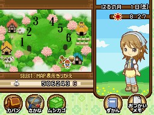

山頂為左右的分界線，兩側各 3 個地圖。每個地圖都有隨機地面採集物，以及固定的採集點（岩壁裂縫、腐樹樁、竹林）。

---

> **條目化狀態（2026-07-12 C3 完成）**：採集物一覽已建立 `basics/items/` 個別條目（花類/蘑菇類/香草類/果實類全數＋素材類的石頭/樹枝/雜草/雪球；銀/銅已有礦物條目、硬幣已有釣魚條目並補註山道入手、廢礦石/礦山石因原文亦無日文名未建）。花類與褐色蘑菇的日文名原為「日文待補」，2026-07-12 已 curl 核對 pixnet 原文補上（原文長音以全形連字號「－」書寫，正規化為「ー」）；鴻喜菇（しめじ）原文載於山道「隨機出現物品」清單、採集物表未列，已另建條目。

## 特殊機制

### 纜繩

左2 和右6 各有一處纜繩（ロープウェイ）區，可以橫越懸崖。

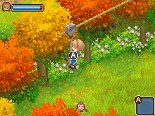

### 淺灘（浅瀬）

左1 和右6 各有一處淺灘，可以直接抓魚和螃蟹，不需要釣竿。

**冬季限定**：河面結冰，須用鎚子（ハンマー）敲碎河面裂縫才能取得物品。

### 跳河

部分地點可以跳進河中，落入後會被沖到下游並隨機獲得物品，有輕微損傷但不致命。

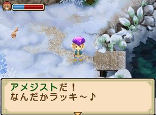

**跳河可能獲得的物品：**

薄荷（ミント）、石頭（石）、硬幣（コイン）、礦山石、紫水晶（アメジスト）、魚骨頭、金針菇（エノキ）、毒蘑菇（毒キノコ）、廢礦石、雜草（雑草）、樹枝（木の枝）

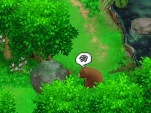

### 雪球（雪玉）

冬季地面可以撿到雪球，扔到地面碎開後會隨機掉落：樹枝、石頭、薰衣草（ラベンダー）、魔術藍草、魔術紅草、月淚草、礦山石、雪球、雜草、咖哩肉包（カレーまん）、球（ボール）。

---

## 岩石開通事件（進階）

山道部分路段被岩石封堵，需完成**隧道挖掘任務**才能陸續開通，共 4 次。

> **觸發條件（每次相同）：** 冬季以外、晴天、09:00–17:59、徒步移動（不可騎馬）、非節日。

| 次數 | 觸發地點 | 開通位置 | 前置條件 |
|------|---------|---------|---------|
| 第 1 次 | 右6 → 右5 | 左下岩石 | 隧道挖掘第 1 次完成 |
| 第 2 次 | 右6 → 右5 | 左上岩石 | 隧道挖掘第 2 次完成 |
| 第 3 次 | 右6 → 右5 | 右下岩石 | 隧道挖掘第 3 次完成 |
| 第 4 次 | 左2 → 左3 | 左邊岩石 | 隧道挖掘全部完成 |

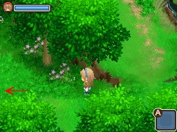
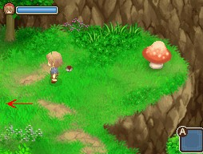

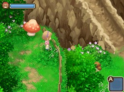

---

## 各地圖採集點

### 左1

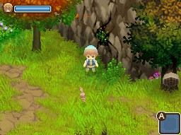

- 左上：岩石裂縫採集點
- 中間：腐樹木採集點
- 右下：樹樁採集點
- 淺灘（可直接抓魚、螃蟹）

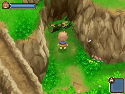
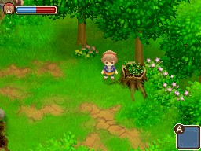

---

### 左2

- 腐樹木採集點
- 彈跳蘑菇（跳台）
- 岩石滑道
- 賢者大人（賢者さま）住家
- 纜繩區
- 橋（通往左3）

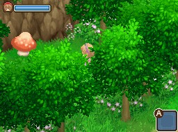

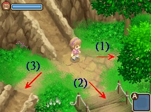
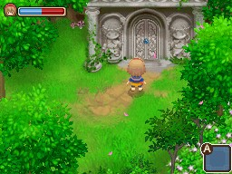

---

### 左3

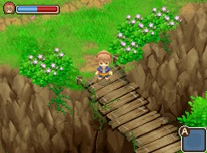

- 橋（來自左2）
- 隨機採集物點
- 釣魚點

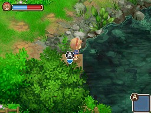

---

### 山頂

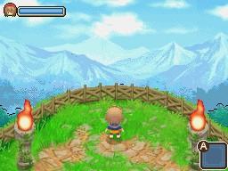

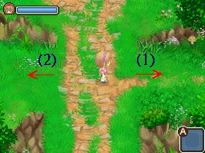
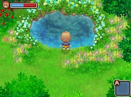

- 木台：可呼喚貓頭鷹
- 女神泉（女神の泉）：位於右側
- 溫泉（温泉）：位於左側，需完成**露天浴場增築任務**後才能使用

---

### 右4（山頂旁）

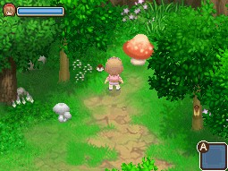

- 岩石滑道
- 彈跳蘑菇（跳台）
- 釣魚點
- 腐樹樁採集點
- 冬季礦石點

---

### 右5

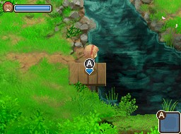
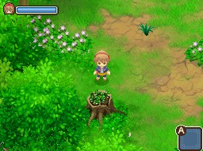

- 彈跳蘑菇（跳台）
- 岩石裂縫採集點
- 瀑布下釣魚點
- 瀑布最下方釣魚點
- 河上岩石跳躍區

**冬季**：右5 淺灘結冰。

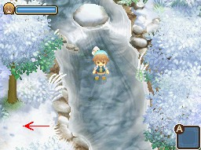

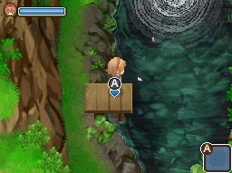
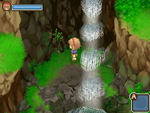
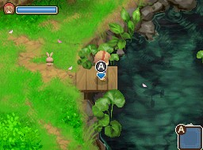
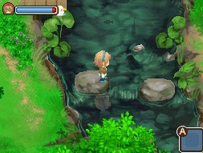

---

### 右6（此花村旁）

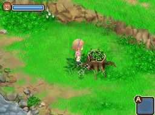

- 淺灘（可直接抓魚、螃蟹）
- 腐樹樁採集點
- 纜繩
- 竹林採集點
- 岩石滑道

<!-- img: http://pic.pimg.tw/leomoon173/e1e2a4ab1ca087e408f0c8966cddec93.jpg -->

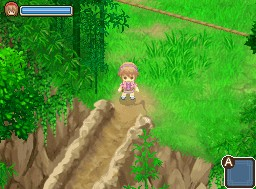
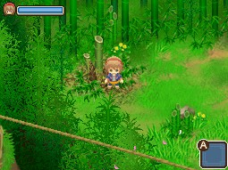

---

## 採集物一覽

採集品質星度隨年份成長：

| 年份 | 品質範圍 |
|------|---------|
| 第 1 年 | ☆0.5 ～ 1.5 |
| 第 2 年 | ☆1.5 ～ 2.0 |
| 第 3 年 | ☆2.5 ～ 3.0 |
| 第 4 年 | ☆3.0 ～ 3.5 |
| 第 5–9 年 | ☆4.0 ～ 4.5 |
| 第 10 年 | 出現 ☆5.0 |

### 花類

| 名稱 | 日文 | 季節 | 品質 | 賣價 |
|------|------|------|------|------|
| 月淚草 | ムーンドロップ草 | 春夏秋 | 1.5☆ | 40G |
| 魔術藍草 | マジックブルー草 | 春夏秋 | 1.5☆ | 40G |
| 魔術紅草 | マジックレッド草 | 夏秋冬 | 1.5☆ | 80G |

### 蘑菇類

| 名稱 | 日文 | 季節 | 品質 | 賣價 |
|------|------|------|------|------|
| 金針菇 | エノキ | 夏秋 | 1.5☆ | 100G |
| 香菇 | シイタケ | 春夏秋 | 1.5☆ | 140G |
| 杏鮑菇 | エリンギ | 秋 | 1.5☆ | 140G |
| 猴頭菇 | ヤマブシタケ | 夏秋 | 1.5☆ | 140G |
| 褐色蘑菇 | ブラウンマッシュ | 春夏 | 1.5☆ | 140G |
| 毒蘑菇 | 毒キノコ | 全年 | 1.5☆ | 30G |

### 香草類

| 名稱 | 日文 | 季節 | 品質 | 賣價 |
|------|------|------|------|------|
| 薄荷 | ミント | 春夏秋 | 1.5☆ | 40G |
| 洋甘菊 | カモミール | 春夏 | 1.5☆ | 40G |
| 薰衣草 | ラベンダー | 秋冬 | 1.5☆ | 40G |

### 果實與其他植物

| 名稱 | 日文 | 季節 | 品質 | 賣價 |
|------|------|------|------|------|
| 竹子 | 竹（たけ） | 春夏 | 1.5☆ | 140G |
| 艾利草 | エリ草 | 冬 | 1.5☆ | 350G |
| 栗子 | 栗（くり） | 秋 | 1.5☆ | 100G |
| 核桃 | クルミ | 冬春夏 | 1.5☆ | 70G |
| 藍莓 | ブルーベリー | 秋 | 1.5☆ | 70G |
| 梅子 | 梅（うめ） | 夏 | 1.5☆ | 70G |
| 杏仁 | アーモンド | 夏 | 1.5☆ | 70G |
| 竹筍 | タケノコ | 春 | 1.5☆ | 70G |
| 蜂巢 | 蜂の巣（はちのす） | 春秋冬 | 1.5☆ | 100G |

### 素材與礦石

| 名稱 | 日文 | 季節 | 賣價 | 備註 |
|------|------|------|------|------|
| 石頭 | 石（いし） | 全年 | 7G | 品質 1.5☆ |
| 樹枝 | 木の枝（きのえだ） | 全年 | 7G | 品質 1.5☆ |
| 雜草 | 雑草（ざっそう） | 全年 | 1G | — |
| 廢礦石 | クズ鉱石 | 全年 | 10G | — |
| 礦山石 | — | 全年 | 1G | — |
| 硬幣 | コイン | 全年 | 100G | — |
| 雪球 | 雪玉（ゆきだま） | 冬 | 1G | 扔地後隨機掉落其他物品 |
| 銀 | 銀（ぎん） | 全年 | 6300G | 品質 1.5☆ |
| 銅 | 銅（どう） | 全年 | 700G | 品質 1.5☆ |

> **注意：** 銀和銅賣價極高，山道上偶爾可撿到，注意留意地面。

---

## 來源

- [NDS牧場物語-雙子村 山道系統完整資訊](https://leomoon173.pixnet.net/blog/posts/5010131758)，擷取於 2026-06-28
