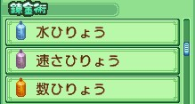
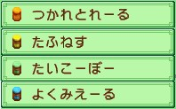
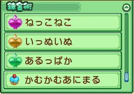

# 煉金術系統攻略

煉金術（れんきんじゅつ）是由賢者大人——[[賢者大人-優萊卡|優萊卡（ユーリカ）]]——提供的特製物品服務，位於[[山道系統|山道（やまみち）]]左2地圖的賢者住家（賢者の家）。

## 開放條件

**第 2 年以後**，晚間 20:00 以後，從藍鈴村（ブルーベル村）山道進入賢者住家地圖即可觸發。

## 煉金規則

| 項目 | 內容 |
|------|------|
| 開放時間 | 16:00～22:00（與主角結婚後改為 14:00～18:00） |
| 可使用日 | 週一、週三、週五 |
| 不可使用 | 雨天、颱風、暴風雨、節日 |
| 費用 | 1,000 G / 次 |
| 每日上限 | 同一物品每天只能製作 1 次，每次製作 1 個 |

## 使用方式

- **肥料類**：放在田地作物旁使用
- **飲用類**：主角飲用後才有效果（時效依各品項說明）
- **動物互動類**：主角飲用後生效

---

## 肥料類

### 水肥料（水ひりょう）

**效果**：自動澆水

**所需材料**：フォー（餐叉）、王様ミルクティー（王家奶茶）、すいか（西瓜）、エリ草（艾利草）、アダマンタイト（金剛石）、賢者の石（賢者之石）

### 快速肥料（速さひりょう）

**效果**：增加作物成長速度

**所需材料**：辛口カレー（辣咖哩）、うめジュース（梅子汁）、キムチつめ合わせ（混合朝鮮泡菜）、トマト（番茄）、ルビー（紅寶石）、賢者の石（賢者之石）

### 倍效肥料（数ひりょう）

**效果**：增加作物收穫數量（收穫作物時生效）

**所需材料**：金の卵（金雞蛋）、エリ草（艾利草）、コモチサケ（帶子鮭魚）、コモチシシャモ（帶子柳葉魚）、賢者の石（賢者之石）、謎の石版（謎之石版）

---

## 飲用類

### 筋疲力盡（つかれとれーる）

**效果**：體力回復 50%

**所需材料**：どくきのこ（毒蘑菇）、ローヤルゼリー（蜂王漿）、エリ草（艾利草）、まっ茶（抹茶）、チョコホールケーキ（巧克力生日蛋糕）、カプチーノ（卡布奇諾咖啡）

### 吃苦耐勞（たふねす）

**效果**：體力消耗減半（時效：1 天）

**所需材料**：至高のカレー（至高咖哩）、ローヤルゼリー（蜂王漿）、ブルーローズ（藍玫瑰）、エリ草（艾利草）、あんず（杏仁）、いちごジャム（草莓醬）

### 太公望（たいこーぼー）

**效果**：釣魚時不需連打按鍵上鉤（時效：1 天）

**所需材料**：もも（桃子）、チビザメ（短種翻車魚）、魚のエサ（魚飼料）

### 清新明亮（よくみえーる）

**效果**：礦坑隧道視野增強（時效：1 天）

**所需材料**：いちご（草莓）、にんじん（胡蘿蔔）、ほたる石（螢石）

---

## 動物互動類

### 小貓咪（ねっこねこ）

**效果**：使貓主動靠近主角（時效：1 小時）

**所需材料**：長ぐつ（長靴）、すず（貓鈴）、ワンニャンフード（寵物飼料）、マジックレッド草（魔術紅草）

### 小狗狗（いっぬいぬ）

**效果**：使狗主動靠近主角（時效：1 小時）

**所需材料**：ボール（球）、骨ガム（骨膠）、ワンニャンフード（寵物飼料）、マジックブルー草（魔術藍草）

### 羊駝（あるっぱか）

**效果**：使羊駝主動靠近主角（時效：1 小時）

**所需材料**：白いアルパカの毛（白色羊駝的毛）、茶色いアルパカの毛（茶色羊駝的毛）、飼い葉（牧草）、動物の薬（動物的藥）、エリ草（艾利草）、高貴なる純白（高貴的純白花束）

### 咬咬動物（かむかむあにまる）

**效果**：增加野生動物好友度

**所需材料**：油あげ（油炸豆腐）、極チーズ（極品奶酪）、とうもろこし（玉米）、金の卵（金雞蛋）、ササ（竹子）、バラのハチミツ（薔薇之蜂蜜）

> 飲用「小貓咪」「小狗狗」「羊駝」後，同時可少量增加貓、狗、羊駝的愛情度。

---

## 相關

- [[山道系統]] — 煉金術位於山道左2，需從藍鈴村側進入
- [[賢者大人-優萊卡]] — 煉金術的提供者
- [[好感度與愛情度系統]] — 動物互動類物品可提升動物愛情度

## 來源

- [NDS 牧場物語-雙子村 煉金術、6色耀珠簡介](https://leomoon173.pixnet.net/blog/posts/5010796906)，擷取於 2026-07-01
