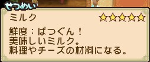
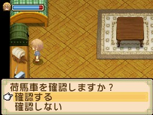

## 維持物品保鮮度小技巧

有保鮮度的物品，保鮮度會隨著遊戲時間而慢慢變質（冬天變質的速度會比較慢一點）。保鮮度變質順序：

1. `ぼつぐん！`（鮮度拔群！）
2. `まだまだイケる`（還算可以！）
3. `少しいたんだかな？`（稍微有點壞了吧？）
4. `そろそろヤバい…！`（有點不妙阿..！）
5. `くさってしまった…`（腐爛了..）

因為初期的馬車（倉庫）沒有保鮮功能，可以使用以下小技巧讓物品延長保鮮（有完美保鮮的馬車後就不用了）：

**說明**：同品質的物品才能累疊；新鮮度變質的物品無法與最新物品累疊；這個方法是在物品變質之前累疊上去延長保鮮，物品本身的新鮮度是無法恢復的。

**方法**：有最新鮮的同品質物品時，不要從背包裡拉進倉庫累疊，而是從倉庫裡拉出來到背包累疊。

例如：撿到新的香草後，倉庫裡也有香草，而倉庫裡的香草是舊有的——不要把背包裡的放進去倉庫，要把倉庫裡的拉出來到背包累疊後，再放回倉庫，倉庫裡的香草就可以保持新鮮度。

## 背包介紹（背包無法擴大）

背包沒有保冷機制（保鮮）功能。背包分為物品欄（`かバん`）、魚類欄（`さかな`）、昆蟲欄（`ムシカゴ`）。

- X 鍵：打開背包。
- L 鍵、R 鍵：進入背包或倉庫欄位後，可以翻頁。

| 欄位 | 頁數 | 每頁格數 | 用途 |
|---|---|---|---|
| 物品欄（かバん） | 3 頁 | 12 格 | 放置所有物品 |
| 魚類欄（さかな） | 1 頁 | 12 格 | 放置抓到、釣到的魚 |
| 昆蟲欄（ムシカゴ） | 1 頁 | 12 格 | 放置抓到的昆蟲 |

## 馬車（倉庫）一覽

- 在自宅的馬車模型，可以更換馬車的類型。
- 使用馬車只要騎著馬到馬車地方（自宅左邊），按 R 鍵可讓馬拖著馬車或者卸下馬車。
- 馬車＝倉庫，自宅裡的倉庫箱（深綠色箱子）跟馬車是相通的。
- 對著馬車按 A 鍵，可以直接從馬車拿取物品或放入物品（物品也可以扔進馬車）。把物品準確地直接投進馬車後，會有 Good 的音效。
- 依不同種類的馬車外觀，重量、保冷機制（保鮮）、倉庫頁數都不同。
- 馬車改造＝倉庫改造，改造後可以增加物品放置的格數（頁數）。倉庫欄每頁 12 格，下方頁數只會顯示 1/1，只有放滿第 13 格，才會出現下一頁。
- 馬車的重量不同，必須使用不同品種的馬才拉得動（拉馬車的速度）：

| 馬車重量 | 所需馬種 |
|---|---|
| 重量 1 | ポニー（矮種馬） |
| 重量 2 | サラブレッド（英國產良種馬） |
| 重量 3 | どさんこ（北海道馬） |

郵政馬車、神轎馬車、雪橇，無論住在哪個村落，最終都能全部入手。

### 破爛不堪的馬車（ボロボロ荷馬車）

入手方法：初期就有。

| 保冷機制（保鮮） | 重量 | 初期頁數 | 改造費用／頁數 |
|---|---|---|---|
| 沒有 | 1 | 2P | 1,000G／3P |
| - | - | - | 2,000G／4P（最大頁數） |

### 藍白條馬車（しましま荷馬車）

入手方法：第 1 年馬屋，5,000G 購買。

| 保冷機制（保鮮） | 重量 | 初期頁數 | 改造費用／頁數 |
|---|---|---|---|
| 沒有 | 1 | 4P | 3,000G／5P |
| - | - | - | 5,000G／6P（最大頁數） |

### 竹製馬車（竹の荷馬車）

入手方法：第 1 年馬屋，5,000G 購買。

| 保冷機制（保鮮） | 重量 | 初期頁數 | 改造費用／頁數 |
|---|---|---|---|
| 沒有 | 1 | 4P | 3,000G／5P |
| - | - | - | 5,000G／6P（最大頁數） |

### 神轎馬車（みこし荷馬車）

入手方法：第 2 年料理大會（料理祭り）優勝獎品。

| 保冷機制（保鮮） | 重量 | 初期頁數 | 改造費用／頁數 |
|---|---|---|---|
| 少許保鮮 | 2 | 6P | 10,000G／7P |
| - | - | - | 30,000G／8P（最大頁數） |

### 郵政馬車（ゆうびん荷馬車）

入手方法：第 2 年料理大會優勝獎品。

| 保冷機制（保鮮） | 重量 | 初期頁數 | 改造費用／頁數 |
|---|---|---|---|
| 少許保鮮 | 2 | 6P | 10,000G／7P |
| - | - | - | 30,000G／8P（最大頁數） |

### 雪橇（そり）

入手方法：第 2 年夏季後，隧道已經開通，料理大會優勝獎品。

| 保冷機制（保鮮） | 重量 | 初期頁數 | 改造費用／頁數 |
|---|---|---|---|
| 少許保鮮 | 2 | 6P | 10,000G／7P |
| - | - | - | 30,000G／8P（最大頁數） |

### 獅子舞（シシマイ）

入手方法：第 3 年馬屋，300,000G 購買。

| 保冷機制（保鮮） | 重量 | 初期頁數 | 改造費用／頁數 |
|---|---|---|---|
| 少許保鮮 | 2 | 7P | 30,000G／8P |
| - | - | - | 100,000G／9P（最大頁數） |

### 機器小雞（メカニワトリ）

入手方法：第 3 年馬屋，300,000G 購買。

| 保冷機制（保鮮） | 重量 | 初期頁數 | 改造費用／頁數 |
|---|---|---|---|
| 完美保鮮 | 3 | 7P | 30,000G／8P |
| - | - | - | 100,000G／9P（最大頁數） |

### UFO 型（UFOトレイン）

入手方法：[[賢者大人-優萊卡|賢者大人]]（賢者さま）的任務 `未知との遭遇`（與未知的邂逅），需賢者大人好友度 1～2 朵花以上、主角任務等級 LV4 以上。任務所需物品：19,771,116G＋謎之石版（謎の石版）×1＋白色羊駝毛（白いアルパカの毛）☆3.0 以上 ×5。詳細任務條件見 [[米海爾女神大人艾瑞拉賢者任務]]。

| 保冷機制（保鮮） | 重量 | 初期頁數 | 改造費用／頁數 |
|---|---|---|---|
| 完美保鮮 | 1 | 5P | 5,000G／6P |
| - | - | - | 10,000G／7P |
| - | - | - | 30,000G／8P |
| - | - | - | 100,000G／9P（最大頁數） |

### 瓦楞紙（ダンボール，紙箱荷馬車）

入手方法：賢者大人（賢者さま）的任務 `古き時の思い出`（古老的記憶），需賢者大人好友度 1～2 朵花以上、主角任務等級 LV4 以上。任務所需物品：30,000,000G＋賢者之石（賢者の石）×1＋茶色羊駝毛（茶色いアルパカの毛）☆3.0 以上 ×5。詳細任務條件見 [[米海爾女神大人艾瑞拉賢者任務]]。

| 保冷機制（保鮮） | 重量 | 初期頁數 | 改造費用／頁數 |
|---|---|---|---|
| 沒有 | 1 | 3P | 2,000G／4P |
| - | - | - | 3,000G／5P |
| - | - | - | 5,000G／6P |
| - | - | - | 10,000G／7P |
| - | - | - | 30,000G／8P |
| - | - | - | 100,000G／9P（最大頁數） |

## 相關

- [[米海爾女神大人艾瑞拉賢者任務]] — UFO 荷馬車、紙箱荷馬車的完整任務條件與謝禮列表

## 來源

- [NDS 牧場物語-雙子村 背包、馬車(倉庫)簡介](https://leomoon173.pixnet.net/blog/posts/5011407708)，擷取於 2026-07-05
