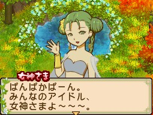

女神大人（女神さま）居住於山頂泉，第 1 年春天第 21 天後可前往拜訪互動。生日為春天第 8 天。

## 禮物攻略重點

女神偏愛自然系物品：花卉、香草、農作物、[[草莓]]。討厭茶葉、[[蜂巢]]、[[梅子]]與巧克力類甜點。送草莓或各種農作物最安全。

## 任務

女神大人在**[[此花村]]告示板**發布委託，需主角使者等級達 **Lv10（女神大人の使者）** 才會出現，從 RANK B 開始。謝禮以種子（草莓、[[西瓜]]、菠蘿、[[可可]]樹）及寶石（[[月亮石]]、[[鑽石]]、[[粉紅鑽石]]）為主。任務物品由系統隨機決定，同一任務名稱每次需求不同；謝禮欄物品數量來源未記載，金額為主要參考。通用機制（任務等級、謝禮星度、期限）見 [[委託任務系統]]。

### RANK B

| 任務名 | 所需物品（隨機之一） | 謝禮 |
|--------|---------------------|------|
| `のどがかわいた`（口渴了） | [[奇蹟牛奶]]（ミラクルミルク）☆2.0以上 ×6 | 草莓種子、西瓜種子、月亮石（ムーンストーン） |
| `おなかすいた`（肚子餓了） | 胡桃（クルミ）☆2.0以上 ×7 | 草莓種子、西瓜種子、月亮石 |
| | [[玉米]]（とうもろこし）☆2.0以上 ×7 | |

### RANK A

| 任務名 | 所需物品（隨機之一） | 謝禮 |
|--------|---------------------|------|
| `お酒ちょうだい`（給我酒） | [[杯裝栗子酒]]（グラスくり酒）☆2.0以上 ×7 | 草莓種子、菠蘿種子、鑽石（ダイヤモンド） |
| | [[杯裝蜂蜜酒]]（グラスハチミツ酒）☆2.0以上 ×7 | |
| | [[果酒]]（果実酒）☆2.0以上 ×7 ※製造機 | |
| | 杯裝[[杏仁]]酒（グラスあんず酒）☆2.0以上 ×7 | |
| `のどがかわいた` | 奇蹟[[牛奶]]（ミラクルミルク）☆2.0以上 ×6 | 草莓種子、菠蘿種子、鑽石 |
| `おなかすいた` | 胡桃（クルミ）☆2.5以上 ×7 | 草莓種子、菠蘿種子、鑽石 |
| | [[橘子]]（みかん）☆2.5以上 ×8 | |
| | [[菠菜]]（ほうれん草）☆2.0以上 ×7 | |
| | 口蘑（しめじ）☆2.0以上 ×6 | |

### RANK S

| 任務名 | 所需物品（隨機之一） | 謝禮 |
|--------|---------------------|------|
| `おなかすいた` | [[草莓大福]]（いちご大福）☆2.0以上 ×6 ※草莓＋調味料＋[[年糕]] | 草莓種子、可可樹種子、粉紅鑽石（ピンクダイヤ） |
| | [[蘿蔔]]（大根）☆2.5以上 ×8 | |
| | 橘子（みかん）☆2.5以上 ×8 | |

## 來源

- [NDS 牧場物語-雙子村 所有村民簡單介紹](https://leomoon173.pixnet.net/blog/posts/5010149856)，擷取於 2026-06-28
- [NDS 牧場物語-雙子村 米海爾、女神大人、賢者大人、艾瑞拉的任務](https://leomoon173.pixnet.net/blog/posts/5012789425)，擷取於 2026-07-01
