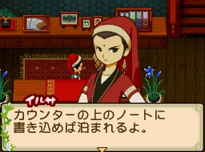

伊爾薩（イルサ）是[[此花村]]的官員，生日為夏天第 5 天。兒子為[[此花村-琉伊|琉伊]]。

## 禮物攻略重點

偏好辛辣料理與日本茶，特別喜歡咖哩系列。討厭甜食（布丁、麻糬、蜂蜜）。

## 來源

- [NDS 牧場物語-雙子村 所有村民簡單介紹](https://leomoon173.pixnet.net/blog/posts/5010149856)，擷取於 2026-06-28
