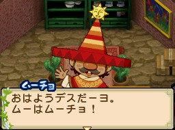

穆喬（ムーチョ）是[[此花村]]的農夫見習，生日為夏天第 21 天。兄弟為[[藍鈴村-弗喬|弗喬]]（藍鈴村）與[[藍鈴村-盧喬|盧喬]]（藍鈴村）。

## 禮物攻略重點

喜歡炸物料理（可樂餅、天婦羅）與咖哩。討厭甜食與蜻蜓類。三兄弟中口味最西化。

## 來源

- [NDS 牧場物語-雙子村 所有村民簡單介紹](https://leomoon173.pixnet.net/blog/posts/5010149856)，擷取於 2026-06-28
