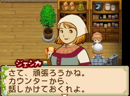

傑西卡（ジェシカ）是[[藍鈴村]]動物店的店員，生日為夏天第 17 天。

## 家庭關係

子女：亞修、[[藍鈴村-雪莉露|雪莉露]]

## 禮物攻略重點

最喜歡乳製品相關料理與飲品。討厭日式傳統料理（粥、湯豆腐）與昆蟲。

## 任務

在藍鈴村告示板接受委託後，攜帶指定物品與本人對話即完成；任務物品由系統隨機決定，同一任務名稱每次需求不同。通用機制（任務等級、謝禮星度、期限）見 [[委託任務系統]]。

### RANK D

| 任務名 | 所需物品 | 主要報酬 |
|--------|----------|----------|
| 珍チーズ作り（起司製作） | 甘菊（カモミール）×3 | 240G、牧草 |
| つくろいもの（修補衣物） | 羊毛（ウール）×2 | — |

### RANK C

| 任務名 | 所需物品 | 主要報酬 |
|--------|----------|----------|
| ごはんをお願い（拜託吃飯） | 蕃茄沙拉（トマトサラダ）×3 | 540G、牧草 |
| ウシ達のため（為牛著想） | 秋茶葉×2 | — |

### RANK B

| 任務名 | 所需物品 | 主要報酬 |
|--------|----------|----------|
| 珍チーズ作り | 粉紅玫瑰×4、延命菊×4（等，隨機） | 500G、牧草、黃油 |
| ごはんをお願い | 水蘿蔔湯×?、蕃茄沙拉×5 | — |
| つくろいもの | 羊毛×5、毛線團（毛糸玉）×5 | — |
| バイトぼしゅう（打工）19:00 前 | 到動物屋協助 | |
| 　↳ ブラッシング（刷毛） | 實際操作 | 160G、上等奶酪 |
| 　↳ ミルクしぼり（擠牛奶） | 實際操作 | 160G、上等黃油 |

### RANK A

| 任務名 | 所需物品 | 主要報酬 |
|--------|----------|----------|
| 珍チーズ作り | 薄荷（ミント）×5、甘菊×6 | 3089G、牧草、黃油、奶酪 |
| ごはんをお願い | 香草三明治×5、法式香煎板魚×6 | — |
| ウシ達のため | 玫瑰茶罐×6、香草茶罐×5 | — |
| つくろいもの | 好羊毛×8、毛線團×7（等） | — |

### RANK S

| 任務名 | 所需物品 | 主要報酬 |
|--------|----------|----------|
| ウシ達のため | 香草茶罐（ハーブティー缶）×7、金礦石混合紅茶罐×6 | 3599G、牧草、上等黃油、上等奶酪 |
| つくろいもの | 羊毛×6、黑羊毛線球×7（等） | — |
| 珍チーズ作り | 白玫瑰×7、薄荷×6 | — |

## 來源

- [NDS 牧場物語-雙子村 所有村民簡單介紹](https://leomoon173.pixnet.net/blog/posts/5010149856)，擷取於 2026-06-28
- [NDS 牧場物語-雙子村 「藍鈴村」任務系統完整資訊](https://leomoon173.pixnet.net/blog/posts/5010894818)，擷取於 2026-07-01
