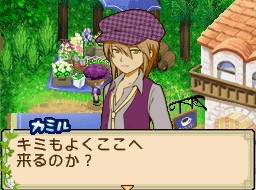

卡米爾（カミル）是[[藍鈴村]]鮮花店的主人，生日為秋天第 1 天。屬於女主人公可攻略的對象。

## 商店

卡米爾鮮花店販售花束、香水等花卉加工品，詳見 [[藍鈴村商店指南]]。

## 戀愛事件

通用規則（愛情度花朵等級、求婚道具等）見 [[戀愛事件-女主人公|戀愛事件系統說明]]。

**關聯人物**：魯特加（ルドガー）、亞修（アーシュ）、拉茲貝莉（ラズベリー）、霍華德（ハワード）、莉亞（リア）

### 戀愛事件 1（紫色花以上）

| 項目 | 內容 |
|------|------|
| 出現日 | 火曜日 |
| 時間 | 18:00～22:00 |
| 天氣 | 晴天、雪天 |
| 地點 | 花壇前（花だん前） |

- `「やさしそうな良い花達だね」`（都是溫柔可愛的花兒呢） → 愛情度 ＋2,000
- `「おいしそうな良い花達だね」`（看起來很美味的花兒） → 愛情度 **－3,000**

> 此事件選對選項後，卡米爾頭上並不會出現花朵動畫，屬遊戲特殊情況，不代表選錯。

### 戀愛事件 2（藍色花以上）

| 項目 | 內容 |
|------|------|
| 出現日 | 木曜日、金曜日 |
| 時間 | 11:00～16:00 |
| 天氣 | 晴天、雪天 |
| 地點 | 村邊（村はずれ） |

- `「ピンクローズはどう？」`（粉紅玫瑰如何？） → 愛情度 **－2,000**
- `「ガーベラが良いよ！」`（大丁花不錯啊！） → 愛情度 ＋3,000

### 戀愛事件 3（綠色花以上）

| 項目 | 內容 |
|------|------|
| 出現日 | 金曜日 |
| 時間 | 11:00～16:00 |
| 天氣 | 晴天、雪天 |
| 地點 | 花壇前（花だん前） |
| **前置條件** | 魯特加（ルドガー）好友度 5,000 以上 |

- `「ここは、まかせて！」`（這裡就交給我了！） → 愛情度 **－1,000**
- `「2人で頑張れば大丈夫だよ！」`（兩個人一起努力的話沒問題的！） → 愛情度 ＋3,000

### 戀愛事件 4（橙色花以上）

| 項目 | 內容 |
|------|------|
| 出現日 | 木曜日、金曜日 |
| 時間 | 11:00～16:00 |
| 天氣 | 晴天、雪天 |
| 地點 | 河邊（川辺） |
| **前置條件** | 亞修（アーシュ）、拉茲貝莉（ラズベリー）好友度各 10,000 以上 |

- `「元の場所に返しに行こう！」`（回到原來的地方去吧！） → 愛情度 **－4,000**（高扣分，注意）
- `「絶対見つかるよ、大丈夫！」`（一定會找到的，沒問題！） → 愛情度 ＋3,000

### 求婚條件

- **愛情度**：65,000 以上（大紅花）
- **前置條件**：霍華德（ハワード）、莉亞（リア）好友度各 30,000 以上；擁有雙人床
- **求婚後**：卡米爾愛情度 ＋3,000、霍華德與莉亞好友度各 ＋1,000
- **婚禮**：卡米爾愛情度 ＋3,000、霍華德與莉亞好友度各 ＋1,000、在場村民好友度各 ＋500

## 禮物攻略

**最喜歡**：泰式酸辣湯（トムヤンクン）。

偏愛玫瑰葡萄酒（ローズワイン）、火鍋系料理（フォンデュ系の料理）、香草沙拉（ハーブサラダ）、紅茶系飲品，以及花卉與香水——與他經營鮮花店的形象一致。

**最討厭**：巧克力生日蛋糕（チョコホールケーキ）。蜂蜜系（はちみつ系）、甜點系（お菓子系）、果汁系（ジュース系）整體皆不受喜愛；也討厭蟬、蝗蟲、蟋蟀、蜻蜓等昆蟲。

## 約會資訊

可在週二 18:00–22:00、週四與週五 11:00–16:00 約會。

喜歡在[[藍鈴村]]的村邊（村はずれ）、花壇前（花だん前）、川邊（川辺）約會；教會附近（教会そば）反應普通；討厭在廣場（広場）約會。

主人公穿著**日常女裝**（カジュアルガール）可提升卡米爾的好感。

## 每日路線時間表

星期一不在村子裡。

**星期日、二、三、六**
- 6:00～8:00 咖啡店1樓自己的房間
- 8:00～17:30 自己的店舖
- 17:30～20:00 咖啡店1樓左邊房間
- 20:00以後 咖啡店1樓自己的房間

**星期四、五**
- 6:00～10:00 咖啡店1樓自己的房間
- 10:00～12:00 往藍鈴村河邊移動中
- 12:00～20:00 藍鈴村河邊
- 20:00～22:00 往咖啡店移動中
- 22:15以後 咖啡店1樓自己的房間

## 來源

- [NDS 牧場物語-雙子村 所有村民生日一覽](https://leomoon173.pixnet.net/blog/posts/5010878354)，擷取於 2026-07-01
- [NDS 牧場物語-雙子村 所有戀愛對象路線時間](https://leomoon173.pixnet.net/blog/posts/5012321571)，擷取於 2026-07-05
- [結婚候補「カミル」｜牧場物語 ふたごの村＋攻略](https://i-love-game.com/bokujou/love/002.php)，擷取於 2026-07-17
- [恋愛イベント カミル − 牧場物語ふたごの村 攻略Memo](http://bokumonofutago.koryaku-memo.com/data05/5-20.html)，擷取於 2026-07-17
- [好物一覧・恋愛イベント − 牧場物語 ふたごの村 攻略 Wiki*](https://wikiwiki.jp/futago/%E5%A5%BD%E7%89%A9%E4%B8%80%E8%A6%A7)，擷取於 2026-07-17
