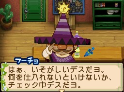

弗喬（フーチョ）是[[藍鈴村]]的農夫，生日為夏天第 4 天。弟弟為[[藍鈴村-盧喬|盧喬]]。

## 禮物攻略重點

典型的日式口味農夫，喜歡沙拉、日本茶與和食。討厭蟬、蝗蟲等害蟲，以及辛辣食物。

## 來源

- [NDS 牧場物語-雙子村 所有村民簡單介紹](https://leomoon173.pixnet.net/blog/posts/5010149856)，擷取於 2026-06-28
