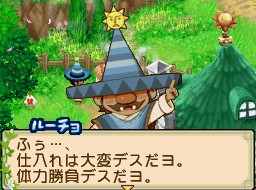

盧喬（ルーチョ）是[[藍鈴村]]的農夫見習，生日為夏天第 26 天。兄弟為[[藍鈴村-弗喬|弗喬]]（藍鈴村）與[[此花村-穆喬|穆喬]]（此花村）。

## 禮物攻略重點

甜食控，尤其喜歡冰淇淋、布丁、蛋糕類甜點。討厭苦味茶飲與毒菇。

## 任務

在藍鈴村告示板接受委託後，攜帶指定物品與本人對話即完成；任務物品由系統隨機決定，同一任務名稱每次需求不同。謝禮欄物品數量來源未記載，金額為主要參考。通用機制（任務等級、謝禮星度、期限）見 [[委託任務系統]]。

### RANK D

| 任務名 | 所需物品（任務物品隨機） | 主要報酬 |
|--------|--------------------------|----------|
| 商品開発だーヨ（商品開發呀！） | 蘿蔔（大根）×2 | 40G、蜂蜜（ハチミツ） |
| 裏取引…（秘密交易…） | 硬幣（コイン）×1 ※淺灘或跳河有機率取得 | 200G、油（油） |
| | 硬幣×2 | |
| わけてチョーダイ（分我一點嘛！） | 栗子（くり）×1 | — |
| | 巨雨濱蛙（クツワアメガエル）×2 | |
| | 短種鯉魚（チビコイ）×2 | |
| | 海蛙（アマガエル）×2 | |
| | 梅子（うめ）×2 | |
| ないしょだヨ！（這是秘密喔！） | 黑鱸魚（ブラックバス）×2 | — |
| | 鱒魚（マス）×3 | |

### RANK C

| 任務名 | 所需物品（任務物品隨機） | 主要報酬 |
|--------|--------------------------|----------|
| わけてチョーダイ | 牛奶（ミルク）×3 | 500G、油 |
| | 水蘿蔔湯（ラディッシュスープ）×3 | |
| | 褐色蘑菇（ブラウンマッシュ）×1 | |
| | 薄荷×1 | |
| | 大種雷魚（デカライギョ）×3 | |
| ないしょだヨ！ | 藍腮太陽魚（ブルーギル）×4 | — |
| | 西太公魚（ワカサギ）×5 | |
| | 短種泥鰍（チビドジョウ）×2 | |
| | 紅樹眼蛙（アカメアマガエル）×3 | |
| ごはんプリーズ（請給我飯！） | 荷包蛋（目玉焼き）×4 | — |
| | 納豆（納豆）×3 | |

### RANK B

| 任務名 | 所需物品（任務物品隨機） | 主要報酬 |
|--------|--------------------------|----------|
| ないしょだヨ！ | 西太公魚×4、虎魚（ハゼ）×4 | 480G、油、咖哩粉（カレーパウダー） |
| | 短種虎魚（チビハゼ）×4、鯉魚（コイ）×4 | |
| わけてチョーダイ | 鱒魚×7、韓式黃瓜拌菜（きゅうりのナムル）×8 | — |
| 裏取引… | 裝信漂流瓶（手紙入りのビン）×5、硬幣×5 | — |

### RANK A

| 任務名 | 所需物品（任務物品隨機） | 主要報酬 |
|--------|--------------------------|----------|
| 裏取引… | 裝信漂流瓶×8、古代魚化石（古代魚化石）×8 | 2480G、咖哩粉、香料（スパイス）、油 |
| | 古代魚化石×5 ※夏季瀑布區釣竿可得、硬幣×6 | |
| わけてチョーダイ | 魔術紅草（マジックレッド草）×6、鯽魚（フナ）×6 | — |
| | 大種虎魚（デカハゼ）×5、胡桃（クルミ）×6 | |
| | 煎雞蛋卷（オムレツ）×5、茶樹種子（お茶の種）×5 | |
| | 蕎麥（そば）×8、胡桃×8 | |
| ないしょだヨ！ | 咖哩麵包（カレーパン）×7、雞蛋卷（だしまき）×7 | — |
| | 短種鯽魚（チビフナ）×6、馬蘇鮭魚（ヤマメ）×5 | |
| | 雷魚（ライギョ）×6、大種泥鰍（デカドジョウ）×5 | |

### RANK S

| 任務名 | 所需物品（任務物品隨機） | 主要報酬 |
|--------|--------------------------|----------|
| わけてチョーダイ | 胡桃×7、黑斑蛙（トノサマガエル）×6 | 3380G、咖哩粉、香料、油 |
| | 土豆種子（じゃがいもの種）×8、含羞草沙拉（ミモザサラダ）×8 | |
| ないしょだヨ！ | 黑斑蛙×7、鱒魚×7 | — |
| ごはんプリーズ | 吐司（トースト）×7、混合醃菜（ピクルスつめ合わせ）×8 | — |
| 裏取引… | 謎之石版（謎の石版）×7、硬幣×7 | — |

## 來源

- [NDS 牧場物語-雙子村 所有村民簡單介紹](https://leomoon173.pixnet.net/blog/posts/5010149856)，擷取於 2026-06-28
- [NDS 牧場物語-雙子村 「藍鈴村」雜貨店、木匠、神父的村民任務](https://leomoon173.pixnet.net/blog/posts/5010896082)，擷取於 2026-07-01
