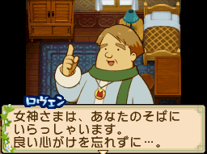

羅萬（ロヴェン）是[[藍鈴村]]的神父，生日為秋天第 4 天。

## 禮物攻略重點

喜好範圍極廣，幾乎什麼都喜歡，包括和洋食料理、甜點、湯品。送禮風險低，幾乎不用擔心踩雷。

## 來源

- [NDS 牧場物語-雙子村 所有村民簡單介紹](https://leomoon173.pixnet.net/blog/posts/5010149856)，擷取於 2026-06-28
- [好物一覧 − 牧場物語 ふたごの村 攻略 Wiki*](https://wikiwiki.jp/futago/%E5%A5%BD%E7%89%A9%E4%B8%80%E8%A6%A7)，擷取於 2026-07-17（最討厭：粉紅鑽石）
