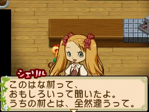

雪莉露（シェリル）是[[藍鈴村]]的學生，生日為春天第 24 天。

## 家庭關係

母親：[[藍鈴村-傑西卡|傑西卡]]

## 禮物攻略重點

喜歡甜點類（布丁、蛋糕、派）。討厭蔬菜及日式茶飲。

## 來源

- [NDS 牧場物語-雙子村 所有村民簡單介紹](https://leomoon173.pixnet.net/blog/posts/5010149856)，擷取於 2026-06-28
