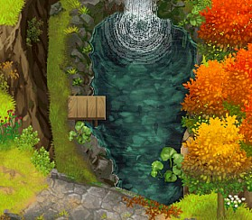
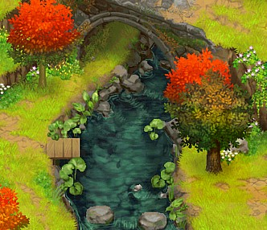
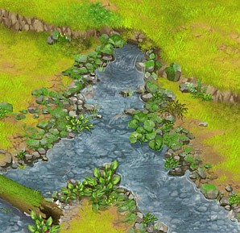

## 基本操作

裝備釣竿（釣竿）後，在釣魚點（顯示 A 圖案的位置）按 A 鍵使用釣竿釣魚，按 B 鍵可把釣竿拉回來。

魚上鉤後，主角頭上會出現驚嘆號，再按 A 鍵連打收竿。有的大尾魚類、魚王（ヌシ）、傳說的寶藏（伝説の宝）、古代魚化石（古代魚の化石）等，收竿連打的速度和次數要快一點。

## 冬季釣魚

冬天河面都會結冰，釣魚點能用錘子往河面的裂痕處敲，可把冰敲碎（淺灘無法敲碎）。冬天淺灘裡的魚類、物品無法獲得。

## 淺灘徒手抓魚

淺灘裡的魚影子，按 A 鍵可以直接徒手抓到魚類、螃蟹、物品。魚影子消失後，可到另一張地圖畫面再回到淺灘的地圖。抓過的同種魚類，大約 3 個小時後會再出現。

## 釣魚相關機制

- 魚類加上魚王共 69 種。
- 一般釣竿在夏 1 日由村長給主角；奇蹟釣竿（奇跡釣竿）則是秋 1 日後可以接到藍鈴村村長（ブルーベル村長）的任務取得。
- 魚的星度品質會隨著種類而增加，釣到新的魚種越多，星度就會增加。第 4 年後也可以釣到 5 顆星的魚類。
- 有些魚類、物品、不同的地點，需要用奇蹟釣竿才能釣到；奇蹟釣竿也可以釣到一般的魚。
- 釣竿或奇蹟釣竿都能釣到的魚類：柳葉魚（シシャモ）、銀魚（シラウオ）、虎魚（ハゼ）、黑鱸魚（ブラックバス）、藍腮太陽魚（ブルーギル）。
- 不同的時間點可以獲得不同的魚類（早上 6:00～12:00、午後 12:00～17:59、夜晚 18:00～4:59），依魚的種類不同，上鉤的頻繁度（機率）也有所差異。
- 有些不同地點卻是相同魚類，卻也需要不同的釣竿、天氣、季節等條件才能釣到。

## 釣魚、抓魚的地點

釣竿的釣魚點共有 4 處，淺灘可以徒手抓魚。淺灘的魚影子位置：左 1（藍鈴村）有 2 處，左邊跟右邊；右 6（此花村）有 3 處，左邊、中間、右邊。

| 名稱 | 說明 | 位置 |
|---|---|---|
| 淺灘 | 直接徒手抓魚 | 左1（藍鈴村）、右6（此花村） |
| 池 | 釣魚點（需要用釣竿） | 左3（藍鈴村） |
| 河川 | 釣魚點（需要用釣竿） | 右4（此花村） |
| 瀑布下 | 瀑布的正下面釣魚點（需要用釣竿） | 右5（此花村） |
| 瀑布下游 | 瀑布的下游釣魚點（需要用釣竿） | 右5（此花村） |

### 地圖位置

藍鈴村 － 左1 － 左2 － 左3 － 山頂 － 右4 － 右5 － 右6 － 此花村

## 關於魚王（ヌシ）

獲得魚王後，會自動放生，並增加魚王圖鑑資料。哲羅魚★魚王（イトウ）似乎要先釣過花鯉、鯰魚、大鯢那三尾魚王後才釣得到。

| 魚王 | 季節條件 | 地點 |
|---|---|---|
| カメ（烏龜★魚王） | 夏季，颱風 | 淺灘 |
| ナマズ（鯰魚★魚王） | 夏季，雨天 | 瀑布區（右5）、池（左3） |
| イトウ（哲羅魚★魚王） | 冬季 | 池（左3）、川（右4） |
| ニシキゴイ（花鯉★魚王） | 春季 | 瀑布下（右5） |
| オオサンショウウオ（大鯢★魚王） | 秋季，夜晚 | 川（右4） |

魚王釣到會自動放生，沒有出貨賣價；每種魚王在不同地點出現的季節條件也略有差異（見下方各地點資料表）。

## 其他物品

主角跳進河裡後，也有機率獲得硬幣、魚骨頭，不分季節。耀珠（すてき）無法出貨、丟棄。

| 名稱 | 季節 | 獲得地點 | 條件與說明 | 出貨價格 |
|---|---|---|---|---|
| [[硬幣]]（コイン） | 冬以外 | 淺灘 | 有的任務需要此物品 | 100 G |
| [[長靴]]（長ぐつ） | 冬以外 | 全部 | 有的任務、煉金需要此物品 | 20 G |
| [[魚骨頭]]（魚の骨） | 全年 | 淺灘（左1）以外 | 沒其他用處 | 20 G |
| [[皮球]]（ボール） | 冬以外 | 淺灘、左3 | 有的任務、煉金需要此物品 | 20 G |
| [[裝信的漂流瓶]]（手紙入りのビン） | 夏季 | 淺灘（左1） | 可以送人或出貨 | 200 G |
| [[傳說的寶藏]]（伝説の宝） | 秋季 | 池（左3）、瀑布下（右5） | 雨天，夜晚有的任務需要此物品 | 2000 G |
| [[古代魚化石]]（古代魚の化石） | 夏季 | 河川（右4）、瀑布下游（右5） | 有的任務需要此物品 | 4000 G |
| 紫色耀珠（紫のすてき） | 冬季 | 池（左3） | 雪天，需要用奇蹟釣竿 | - |
| 綠色耀珠（緑のすてき） | 夏季 | 瀑布下游（右5） | 雨天，需要用奇蹟釣竿 | - |
| 黃色耀珠（黄のすてき） | 秋季（淺灘左1）、春季（淺灘右6） | - | 雨天 | - |
| 藍色耀珠（青のすてき） | 秋季（淺灘左1）、春季（淺灘右6） | - | - | - |

> 上方 7 項非耀珠物品已建立獨立條目於 `fishing/items/`（詳見各條目內文，部分地點/季節已依各地點魚類表核對修正，與本表原始摘要略有出入）。4 色耀珠已在 [[6色耀珠收集與願望系統攻略]] 有完整資料（含願望系統），這裡不重複建條目；黃色/藍色耀珠的「春季」地點原文誤植為「淺灘左2」，已依 [[6色耀珠收集與願望系統攻略]] 及各地點魚類表核對更正為「淺灘右6（此花村）」。

## 各地點的魚類、物品完整資料表

以下資料保留來源原始的日文名稱、中文譯名、季節、條件（時段／天氣／所需釣竿）、賣價，供之後拆分成個別魚類條目時使用。同一魚種在不同地點的季節、賣價可能不同（例如虎魚在淺灘只有秋天可釣，但在池、河川、瀑布下、瀑布下游全年皆可釣；鰻魚在「池」賣 1960 G，在「瀑布下游」卻只賣 720 G），拆分條目時需要逐一核對，不可直接假設同名魚種在各地點條件一致。

### 淺灘（左1，藍鈴村）

| 日文名稱 | 譯文 | 季節 | 條件 | 賣價G |
|---|---|---|---|---|
| チビイワナ | 短種紅點鮭 | 春 | - | 70 |
| チビウナギ | 短種鰻魚 | 夏 | 夜晚 | 70 |
| チビギル | 短種藍鰓 | 夏 | - | 70 |
| チビサワガニ | 短種河蟹 | 夏、秋 | 夜晚 | 70 |
| チビシシャモ | 短種柳葉魚 | 春、夏 | - | 70 |
| チビシラウオ | 短種銀魚 | 夏 | - | 70 |
| チビドジョウ | 短種泥鰍 | 夏、秋 | - | 70 |
| チビバス | 短種黑鱸魚 | 夏 | - | 70 |
| チビハゼ | 短種虎魚 | 春、夏 | - | 70 |
| チビフナ | 短種鯽魚 | 夏、秋 | - | 70 |
| チビマス | 短種鱒魚 | 夏 | - | 70 |
| チビメダカ | 短種鱂魚 | 春、夏、秋 | - | 70 |
| チビヤマメ | 短種馬蘇鮭魚 | 春 | - | 70 |
| チビワカサギ | 短種西太公魚 | 春 | - | 70 |
| アオサワガニ | 藍色小河蟹 | 夏 | 夜晚 | 80 |
| サワガニ | 小河蟹 | 夏 | 夜晚 | 50 |
| シラウオ | 銀魚 | 夏 | - | 190 |
| ハゼ | 虎魚 | 秋 | - | 280 |
| メダカ | 鱂魚 | 春、夏、秋 | - | 50 |
| ワカサギ | 西太公魚 | 春 | - | 330 |
| カメ | 烏龜★魚王 | 夏 | 颱風 | - |
| コイン | 硬幣 | 春、夏、秋 | - | 100 |
| 長ぐつ | 長靴 | 春、夏、秋 | - | 20 |
| ボール | 皮球 | 春、夏、秋 | - | 20 |
| 手紙入りのビン | 裝信的漂流瓶 | 夏 | - | 200 |
| 黄のすてき | 黃色耀珠 | 秋 | 雨天 | - |
| 青のすてき | 藍色耀珠 | 秋 | 雨天 | - |

### 池（左3，藍鈴村）

| 日文名稱 | 譯文 | 季節 | 條件 | 賣價G |
|---|---|---|---|---|
| チビライギョ | 短種雷魚 | 夏 | - | 500 |
| サバ | 青花魚 | 冬 | 暴風雪 | 1960 |
| シシャモ | 柳葉魚 | 全年 | - | 330 |
| ドジョウ | 泥鰍 | 春、夏 | - | 610 |
| ハゼ | 虎魚 | 全年 | - | 280 |
| ブラックバス | 黑鱸魚 | 全年 | - | 280 |
| ブルーギル | 藍腮太陽魚 | 全年 | - | 250 |
| マス | 鱒魚 | 春、夏、秋 | - | 560 |
| ワカサギ | 西太公魚 | 冬 | - | 330 |
| ウナギ | 鰻魚 | 春、夏 | 奇蹟釣竿 | 1960 |
| カツオ | 鰹魚 | 夏 | 颱風，奇蹟釣竿 | 2800 |
| サケ | 鮭魚 | 夏、秋 | 奇蹟釣竿 | 920 |
| マンボウ | 翻車魚 | 夏 | 颱風，奇蹟釣竿 | 4200 |
| デカドジョウ | 大種泥鰍 | 夏 | 奇蹟釣竿 | 840 |
| デカバス | 大種黑鱸魚 | 冬 | 奇蹟釣竿 | 560 |
| デカギル | 大種藍鰓 | 冬 | 奇蹟釣竿 | 560 |
| デカマス | 大種鱒魚 | 秋、冬 | 奇蹟釣竿 | 720 |
| デカメダカ | 大種鱂魚 | 秋 | 奇蹟釣竿 | 840 |
| ナマズ（ヌシ） | 鯰魚★魚王 | 夏 | 雨天 | - |
| イトウ（ヌシ） | 哲羅魚★魚王 | 冬 | - | - |
| 魚の骨 | 魚骨頭 | 全年 | - | 20 |
| 長靴 | 長靴 | 春、夏、秋 | - | 20 |
| ボール | 皮球 | 春、夏、秋 | - | 20 |
| 伝説の宝 | 傳說的寶藏 | 秋 | 雨天，夜晚 | 2000 |
| 紫のすてき | 紫色耀珠 | 冬 | 雪天，奇蹟釣竿 | - |

### 河川（右4，此花村）

| 日文名稱 | 譯文 | 季節 | 條件 | 賣價G |
|---|---|---|---|---|
| チビサケ | 短種鮭魚 | 春 | - | 420 |
| チビバス | 短種黑鱸魚 | 夏 | - | 70 |
| アユ | 香魚 | 春、夏、秋 | - | 240 |
| シシャモ | 柳葉魚 | 全年 | - | 330 |
| シラウオ | 銀魚 | 春、夏、秋 | - | 190 |
| ハゼ | 虎魚 | 全年 | - | 280 |
| フナ | 鯽魚 | 春、夏、秋 | - | 560 |
| ブラックバス | 黑鱸魚 | 全年 | - | 280 |
| ブルーギル | 藍腮太陽魚 | 全年 | - | 250 |
| マス | 鱒魚 | 春、夏、秋 | - | 560 |
| ライギョ | 雷魚 | 春、夏、秋 | - | 580 |
| ワカサギ | 西太公魚 | 冬 | - | 330 |
| コモチサケ | 帶子鮭魚 | 秋 | 奇蹟釣竿 | 1060 |
| スズキ | 鱸魚 | 春、夏、秋 | 奇蹟釣竿 | 860 |
| マグロ | 金槍魚 | 夏 | 颱風，奇蹟釣竿 | 2800 |
| デカアユ | 大種香魚 | 秋、冬 | 奇蹟釣竿 | 890 |
| デカウナギ | 大種鰻魚 | 夏 | 奇蹟釣竿 | 920 |
| デカスズキ | 大種鱸魚 | 夏 | 奇蹟釣竿 | 950 |
| デカフナ | 大種鯽魚 | 春 | 奇蹟釣竿 | 840 |
| デカマス | 大種鱒魚 | 秋、冬 | 奇蹟釣竿 | 720 |
| デカワカサギ | 大種西太公魚 | 冬 | 奇蹟釣竿 | 700 |
| オオサンショウウオ（ヌシ） | 大鯢★魚王 | 秋 | 夜晚（0:00後） | - |
| イトウ（ヌシ） | 哲羅魚★魚王 | 冬 | 奇蹟釣竿 | - |
| 古代魚の化石 | 古代魚化石 | 夏 | - | 4000 |
| 魚の骨 | 魚骨頭 | 全年 | - | 20 |
| 長靴 | 長靴 | 春、夏、秋 | - | 20 |

### 瀑布下（右5，此花村）

| 日文名稱 | 譯文 | 季節 | 條件 | 賣價G |
|---|---|---|---|---|
| イワナ | 紅點鮭 | 春、夏、秋 | - | 580 |
| コモチシシャモ | 帶子柳葉魚 | 秋、冬 | - | 810 |
| シシャモ | 柳葉魚 | 全年 | - | 330 |
| ハゼ | 虎魚 | 全年 | - | 280 |
| ブラックバス | 黑鱸魚 | 全年 | - | 280 |
| ブルーギル | 藍腮太陽魚 | 全年 | - | 250 |
| ヤマメ | 馬蘇鮭魚 | 春、夏、秋 | - | 610 |
| チビザメ | 短種翻車魚 | 夏 | 颱風，奇蹟釣竿 | 420 |
| カツオ | 鰹魚 | 夏 | 颱風，奇蹟釣竿 | 2800 |
| サケ | 鮭魚 | 夏、秋 | 奇蹟釣竿 | 920 |
| ヒラメ | 比目魚 | 冬 | 暴風雪，奇蹟釣竿 | 2800 |
| デカウナギ | 大種鰻魚 | 夏 | 奇蹟釣竿 | 920 |
| デカハゼ | 大種虎魚 | 冬 | 奇蹟釣竿 | 840 |
| デカヤマメ | 大種馬蘇鮭魚 | 秋 | 奇蹟釣竿 | 920 |
| デカライギョ | 大種雷魚 | 夏 | 奇蹟釣竿 | 840 |
| ナマズ（ヌシ） | 鯰魚★魚王 | 夏 | 雨天 | - |
| ニシキゴイ（ヌシ） | 花鯉★魚王 | 春 | - | - |
| 伝説の宝 | 傳說的寶藏 | 秋 | 雨天，夜晚 | 2000 |
| 魚の骨 | 魚骨頭 | 全年 | - | 20 |
| 長靴 | 長靴 | 春、夏、秋 | - | 20 |
| ボール | 皮球 | 春、夏、秋 | - | 20 |

### 瀑布下游（右5，此花村）

| 日文名稱 | 譯文 | 季節 | 條件 | 賣價G |
|---|---|---|---|---|
| チビスズキ | 短種鱸魚 | 春 | - | 700 |
| チビライギョ | 短種雷魚 | 夏 | 夜晚 | 500 |
| コイ | 鯉魚 | 全年 | - | 840 |
| シシャモ | 柳葉魚 | 全年 | - | 330 |
| ドジョウ | 泥鰍 | 春、夏 | - | 610 |
| ハゼ | 虎魚 | 全年 | - | 280 |
| ブラックバス | 黑鱸魚 | 全年 | - | 280 |
| ブルーギル | 藍腮太陽魚 | 全年 | - | 250 |
| ワカサギ | 西太公魚 | 冬 | - | 330 |
| チビザメ | 短種翻車魚 | 夏 | 颱風，奇蹟釣竿 | 420 |
| ウツボ | 海鱔 | 冬 | 暴風雪，奇蹟釣竿 | 1960 |
| ウナギ | 鰻魚 | 春、夏 | 奇蹟釣竿 | 720 |
| カツオ | 鰹魚 | 夏 | 颱風，奇蹟釣竿 | 2800 |
| スズキ | 鱸魚 | 春、夏、秋 | 奇蹟釣竿 | 860 |
| ヒラメ | 比目魚 | 冬 | 暴風雪，奇蹟釣竿 | 2800 |
| デカイワナ | 大種紅點鮭 | 春 | 奇蹟釣竿 | 980 |
| デカシラウオ | 大種銀魚 | 春 | 奇蹟釣竿 | 840 |
| デカスズキ | 大種鱸魚 | 夏 | 奇蹟釣竿 | 950 |
| デカドジョウ | 大種泥鰍 | 夏 | 奇蹟釣竿 | 840 |
| デカライギョ | 大種雷魚 | 夏 | 奇蹟釣竿 | 840 |
| ナマズ（ヌシ） | 鯰魚★魚王 | 夏 | 雨天 | - |
| 古代魚の化石 | 古代魚化石 | 夏 | - | 4000 |
| 緑のすてき | 綠色耀珠 | 夏 | 雨天，奇蹟釣竿 | - |
| 魚の骨 | 魚骨頭 | 全年 | - | 20 |
| 長靴 | 長靴 | 春、夏、秋 | - | 20 |

> 來源這裡「鰻魚」（ウナギ）在「池」列出賣價 1960 G，在「瀑布下游」卻列出 720 G，兩處數字不一致，來源本身未解釋原因，之後拆分條目時需要向使用者確認哪個才對，或兩者都保留並註明差異。

### 淺灘（右6，此花村）

| 日文名稱 | 譯文 | 季節 | 條件 | 賣價G |
|---|---|---|---|---|
| チビアユ | 短種香魚 | 春、夏 | - | 70 |
| チビイワナ | 短種紅點鮭 | 春 | - | 70 |
| チビウナギ | 短種鰻魚 | 夏 | 夜晚 | 70 |
| チビギル | 短種藍鰓 | 夏 | - | 70 |
| チビコイ | 短種鯉魚 | 夏、秋 | - | 70 |
| チビサワガニ | 短種河蟹 | 春 | 夜晚 | 70 |
| チビシャンガニ | 大種河蟹 | 夏 | 夜晚 | 70 |
| チビシラウオ | 短種銀魚 | 秋 | - | 70 |
| チビドジョウ | 短種泥鰍 | 夏、秋 | - | 70 |
| チビバス | 短種黑鱸魚 | 夏 | - | 70 |
| チビフナ | 短種鯽魚 | 春、夏 | - | 70 |
| チビマス | 短種鱒魚 | 春 | - | 70 |
| チビメダカ | 短種鱂魚 | 春、夏、秋 | - | 70 |
| チビヤマメ | 短種馬蘇鮭魚 | 春 | - | 70 |
| チビワカサギ | 短種西太公魚 | 春 | - | 70 |
| サワガニ | 小河蟹 | 春、夏、秋 | 夜晚 | 50 |
| シラウオ | 銀魚 | 秋 | - | 190 |
| ハゼ | 虎魚 | 秋 | - | 280 |
| メダカ | 鱂魚 | 春、夏、秋 | - | 50 |
| ワカサギ | 西太公魚 | 秋 | - | 330 |
| カメ（ヌシ） | 烏龜★魚王 | 夏 | 颱風 | - |
| コイン | 硬幣 | 春、夏、秋 | - | 100 |
| ボール | 皮球 | 春、夏、秋 | - | 20 |
| 魚の骨 | 魚骨頭 | 春、夏、秋 | - | 20 |
| 黄のすてき | 黃色耀珠 | 春 | 雨天 | - |
| 青のすてき | 藍色耀珠 | 春 | 雨天 | - |

> 「チビシャンガニ」來源譯文標示為「大種河蟹」，但名稱前綴「チビ」通常代表「短種」，可能是原文誤植，之後拆分條目時需要跟使用者確認正確譯名。

## 各個釣魚點的季節魚類

### 春季

| 地點 | 名稱 |
|---|---|
| 左1淺灘 | 短種紅點鮭、短種柳葉魚、短種虎魚、短種鱂魚、短種馬蘇鮭魚、短種西太公魚、鱂魚、西太公魚 |
| 左3池 | 柳葉魚、泥鰍、虎魚、黑鱸魚、藍腮太陽魚、鱒魚、鰻魚（奇蹟釣竿） |
| 右4河川 | 短種鮭魚、香魚、柳葉魚、銀魚、虎魚、鯽魚、黑鱸魚、藍腮太陽魚、鱒魚、雷魚、鱸魚（奇蹟釣竿）、大種鯽魚（奇蹟釣竿） |
| 右5瀑布下 | 紅點鮭、柳葉魚、虎魚、黑鱸魚、藍腮太陽魚、馬蘇鮭魚、花鯉★魚王 |
| 右5瀑布下游 | 短種鱸魚、鯉魚、柳葉魚、泥鰍、虎魚、黑鱸魚、藍腮太陽魚、鰻魚、鱸魚、大種紅點鮭（奇蹟釣竿）、大種銀魚（奇蹟釣竿） |
| 右6淺灘 | 短種香魚、短種紅點鮭、短種河蟹、短種鯽魚、短種鱒魚、短種鱂魚、短種馬蘇鮭魚、短種西太公魚、小河蟹、鱂魚 |

### 夏季

| 地點 | 名稱 |
|---|---|
| 左1淺灘 | 短種鰻魚（夜晚）、短種藍鰓、短種河蟹（夜晚）、短種柳葉魚、短種銀魚、短種泥鰍、短種黑鱸魚、短種虎魚、短種鯽魚、短種鱒魚、短種鱂魚、藍色小河蟹（夜晚）、小河蟹（夜晚）、銀魚、鱂魚、烏龜★魚王（颱風） |
| 左3池 | 短種雷魚、柳葉魚、泥鰍、虎魚、黑鱸魚、藍腮太陽魚、鱒魚、鰻魚、鰹魚（颱風，奇蹟釣竿）、鮭魚（奇蹟釣竿）、翻車魚（颱風，奇蹟釣竿）、大種泥鰍（奇蹟釣竿）、鯰魚★魚王（雨天） |
| 右4河川 | 短種黑鱸魚、香魚、柳葉魚、銀魚、虎魚、鯽魚、黑鱸魚、藍腮太陽魚、鱒魚、雷魚、鱸魚、金槍魚（颱風，奇蹟釣竿）、大種鰻魚（奇蹟釣竿）、大種鱸魚（奇蹟釣竿） |
| 右5瀑布下 | 紅點鮭、柳葉魚、虎魚、黑鱸魚、藍腮太陽魚、馬蘇鮭魚、短種翻車魚（颱風，奇蹟釣竿）、鰹魚（颱風，奇蹟釣竿）、鮭魚（奇蹟釣竿）、大種鰻魚（奇蹟釣竿）、大種雷魚（奇蹟釣竿）、鯰魚★魚王（雨天） |
| 右5瀑布下游 | 短種雷魚、鯉魚、柳葉魚、泥鰍、虎魚、黑鱸魚、藍腮太陽魚、大種鱸魚（奇蹟釣竿）、大種泥鰍（奇蹟釣竿）、大種雷魚（奇蹟釣竿）、鰹魚（颱風，奇蹟釣竿）、短種翻車魚（颱風，奇蹟釣竿）、鯰魚★魚王（雨天） |
| 右6淺灘 | 短種香魚、短種鰻魚（夜晚）、短種藍鰓、大種河蟹（夜晚）、短種黑鱸魚、短種鯽魚、短種鱂魚、小河蟹（夜晚）、鱂魚、烏龜★魚王（颱風） |

### 秋季

| 地點 | 名稱 |
|---|---|
| 左1淺灘 | 短種河蟹（夜晚）、短種泥鰍、短種鯽魚、短種鱂魚、鱂魚、虎魚 |
| 左3池 | 柳葉魚、虎魚、黑鱸魚、藍腮太陽魚、鱒魚、鮭魚、大種鱒魚（奇蹟釣竿）、大種鱂魚（奇蹟釣竿） |
| 右4河川 | 香魚、銀魚、柳葉魚、虎魚、鯽魚、黑鱸魚、藍腮太陽魚、鱒魚、雷魚、帶子鮭魚、鱸魚、大種香魚（奇蹟釣竿）、大種鱒魚（奇蹟釣竿）、大鯢★魚王（夜晚） |
| 右5瀑布下 | 紅點鮭、帶子柳葉魚、柳葉魚、虎魚、黑鱸魚、藍腮太陽魚、馬蘇鮭魚、鮭魚（奇蹟釣竿）、大種馬蘇鮭魚（奇蹟釣竿） |
| 右5瀑布下游 | 鯉魚、柳葉魚、虎魚、黑鱸魚、藍腮太陽魚、鱸魚 |
| 右6淺灘 | 短種鯉魚、短種泥鰍、短種銀魚、短種鱂魚、小河蟹（夜晚）、虎魚、銀魚、鱂魚、西太公魚 |

### 冬季

| 地點 | 名稱 |
|---|---|
| 左3池 | 青花魚（暴風雪）、柳葉魚、虎魚、黑鱸魚、藍腮太陽魚、西太公魚、大種黑鱸魚（奇蹟釣竿）、大種藍鰓（奇蹟釣竿）、大種鱒魚（奇蹟釣竿）、哲羅魚★魚王 |
| 右4河川 | 柳葉魚、虎魚、黑鱸魚、藍腮太陽魚、西太公魚、大種香魚（奇蹟釣竿）、大種鱒魚（奇蹟釣竿）、大種西太公魚（奇蹟釣竿）、哲羅魚★魚王（奇蹟釣竿） |
| 右5瀑布下 | 帶子柳葉魚、柳葉魚、虎魚、黑鱸魚、藍腮太陽魚、比目魚（暴風雪，奇蹟釣竿）、大種虎魚（奇蹟釣竿） |
| 右5瀑布下游 | 鯉魚、柳葉魚、虎魚、黑鱸魚、藍腮太陽魚、西太公魚、海鱔（暴風雪，奇蹟釣竿）、比目魚（暴風雪，奇蹟釣竿） |

冬季無淺灘資料——冬天淺灘裡的魚類、物品無法獲得（見〈冬季釣魚〉一節）。

## 尚待處理

- 65 個魚種（含短種／一般／大種尺寸分級，約 64 個獨立條目）尚未拆成個別 `fishing/fishes/` 條目，因來源未提供 schema 必填的 `time`（可釣時段）與 `size_range`（尺寸範圍）欄位。
- 5 隻魚王（ヌシ）尚未拆成獨立條目，將併入對應物種條目的內文。
- 鰻魚（ウナギ）在「池」與「瀑布下游」兩地點的賣價不一致（1960 G vs 720 G），需要之後確認。
- 「チビシャンガニ」譯文寫「大種河蟹」，但名稱前綴「チビ」一般代表「短種」，疑似來源誤植，需要之後確認。

7 項非魚類雜項物品（硬幣、長靴、魚骨頭、皮球、裝信的漂流瓶、傳說的寶藏、古代魚化石）已建立獨立條目於 `fishing/items/`；4 色耀珠因已有 [[6色耀珠收集與願望系統攻略]] 涵蓋，不重複建條目。

## 來源

- [NDS 牧場物語-雙子村 魚類簡介](https://leomoon173.pixnet.net/blog/posts/5011263060)，擷取於 2026-07-03
