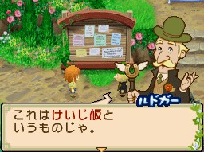
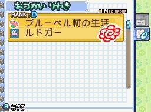
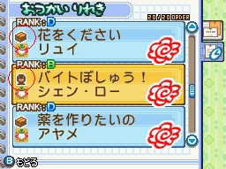

## 委託任務（おつかい）說明

任務單子在村子裡的告示板上，第 1 年的春 2 日村長會教學。[[此花村]]、[[藍鈴村]]都有告示板，無論主角住在哪個村，兩村的任務都可以接。居民住在哪村，任務就在哪村的告示板（[[女神大人]]在此花村，[[賢者大人]]在藍鈴村）。

任務的出現，跟任務委託人的好友度多寡、主角本身的委託任務等級有關聯。重要的任務（道具、改造、增築）在月 1 日（號）出現，普通任務每天隨機出現。牧場增築、工具升級改造的任務，接下任務單子後，必須先跟委託人對話，再選擇增築項目。

接下任務後，必須在期限天數內完成任務（任務期限天數在任務單子的右上角）。完成任務後，委託人可以 +50 的好友度（愛情度）。而「請幫忙送達」（`配達のお願い`）的任務，委託人與交付的任務物品指定人各 +25。

任務沒完成不會減少好友度（愛情度）。普通任務有機率重複出現，重要的任務下個月會重複出現直到完成為止。進行搬家（引越）時要注意，搬家後，已接下的未完成任務會強制結束。

## 完成任務流程

接下任務單子後，只要帶著任務物品，跟委託人對話，交付物品即可完成任務。

馬車與委託人在同張地圖（戶外）時：在物品交付給委託人時，委託人在戶外，馬車也在委託人所在的地圖內，而任務物品放在馬車內，可以按 X 鍵切換馬車交付任務物品。

在下屏幕的委託（`おつかいメモ`），可以查看接下的任務和完成的任務。完成的任務，會有一朵紅色的花樣，表示任務完成。

## 委託任務謝禮相關

完成任務後，可以得到委託人的謝禮物品（牧場增築、工具升級改造除外）。謝禮的物品星度，跟交付的任務物品星度相關（工具、道具任務除外）。

任務的謝禮星度品質，會依任務物品的星度再 +☆0.5（例如：☆1 的任務物品，可以收到 ☆1.5 的任務謝禮）。如果交付最高星度的任務物品，可以得到最高星度的謝禮。

## 任務等級（RANK）相關

只要完成任務，達到提升任務的經驗，就可以提升主角本身的委託任務等級。任務的等級越高，經驗就越多（例如：S 級的經驗最高、D 級的經驗最低）。接取的任務等級越高，能越快提升主角本身的委託任務等級以及稱號。有些任務會需要任務等級的條件（有些任務不需要）。

主角本身的 LV 委託任務等級，可以在下屏幕的圖鑑（藍色筆記本）裡知道（使者等級）。下表的「同時接受的任務數量」是可以同時接取任務數量的最高上限，僅供參考：

| 稱號 | LV | 大約可接受的 RANK | 同時接受的任務數量 |
|---|---|---|---|
| はじめてのおつかい（初來乍到的使者） | 1 | D | 10 |
| おつかい見習い（見習的使者） | 2 | - | 14 |
| おつかい界のエース（使者界的王牌） | 3 | D、C | 18 |
| おつかい界のアイドル（使者界的偶像） | 4 | - | 22 |
| かれいなるおつかい人（非常華麗的使者） | 5 | D、C、B | 26 |
| ふたごの村のおつかい人（雙子村的使者代表） | 6 | - | 30 |
| ベテランおつかい人（老練的使者） | 7 | D、C、B、A | 34 |
| カリスマおつかい人（領袖般的使者） | 8 | - | 38 |
| キングオブ・デリバリー（王者投遞員） | 9 | D、C、B、A、S | 42 |
| 女神さまのおつかい（女神大人的使者） | 10 | - | 46 |

## 任務等級（RANK）物品的星度品質要求

會隨著遊戲年數而不同，第 4 年後都固定（適用所有的任務物品星度要求）：

| RANK | 第1年 | 第2年 | 第3年 | 第4年後 |
|---|---|---|---|---|
| D | 0.5☆ | 0.5☆ | 0.5☆ | 1☆ |
| C | 0.5☆ | 1☆ | 1☆ | 1.5☆ |
| B | 1☆ | 1☆ | 1.5☆ | 2.0☆ |
| A | 1☆ | 1.5☆ | 2.0☆ | 2.5☆ |
| S | 1.5☆ | 2.0☆ | 2.5☆ | 3☆ |

## 委託任務（おつかい）種類

任務的種類由任務單子的顏色和任務名稱前面的圖示可分辨。

### 初期委託任務－綠色（圖示：花朵）

主要是遊戲剛開始的一些教學任務，任務完成後或沒完成任務後不會再出現。委託人會跟主角說一些抓蟲、抓魚等的資訊。

### 普通委託任務－黃色（圖示：紙箱）

委託的任務物品都是魚類、農作物、採集物、動物副產品等物品。每天會隨機出現和有機率重複出現。會依 RANK 的不同，委託人的任務物品的星度會有所要求。也有些任務是委託人委託任務物品交給特定的村民，例如：請幫忙送達（`配達のお願い`）——把任務物品交付給特定的村民，然後再向委託人回報，才算完成任務。

### 尋物（探し物）委託任務－黃色（圖示：紙箱）

任務的單子顏色、圖示，跟普通委託任務相同。每年出現的日期都是固定同一天，任務期限天數都必須當天完成。委託的任務物品是固定的，而會出現需要不同季節以外的任務物品。

任務出現條件：
- 主角本身的委託任務等級需要 LV4 以上。
- 委託人的好友度（愛情度）需要 12400 以上（2 朵花～3 朵花）。

請注意：尋物任務的前天如有 2 天以上的期限任務，該委託人的尋物任務不會出現，因為每個人物的委託任務是一個個出現的（一個人物只先出現一個委託任務，「請幫忙送達」任務除外）。例如：冬 11 日[[瑪奧]]的尋物任務，若 10 日有瑪奧未完成的任務，則冬 11 日瑪奧的尋物任務不會出現。

### 打工募集（バイトぼしゅう！）委託任務－橙色（圖示：人型）

類似打工、幫忙，村民的任務內容，每年出現的日期都是固定同一天。第 2 年後才會出現，任務期限都是當天的 19:00。接下任務後必須先跟委託人對話，對話後才開始進行任務。

任務出現條件：
- 主角本身的委託任務等級需要 LV4 以上。
- 委託人的好友度（愛情度）需要 15500 以上（2 朵花～3 朵花）。

請注意：打工任務的前天如有 2 天以上的期限任務，該委託人的打工任務不會出現（跟尋物相同），因為每個人物的委託任務是一個個出現的（一個人物只先出現一個委託任務）。

打工任務內容包含：田地澆水、收穫作物、採收果樹果實、幫動物刷毛清洗、擠[[牛奶]]。進行任務時，在特定的時間內快速完成任務，可以得到贈品獎勵（雨天接下澆水的任務不算）。如果雨天接下「給田地澆水」（`畑の水まき`）的任務，直接跟委託人對話即可得到謝禮。完成任務後的謝禮是 0.5☆，隨著遊戲年數增加會提高到 1.5☆，第 4 年後固定都 1.5☆，另外的贈品獎勵都是 4☆。接下採收作物、採收果樹果實的任務，作物、果實會自動收進給委託人。

打工任務的委託人有：
- 此花村：[[此花村-娜娜|娜娜]]、[[此花村-古恩貝|古恩貝]]、[[此花村-迪魯卡|迪魯卡]]、[[此花村-神·羅|神‧羅]]、[[此花村-札烏利|札烏利]]。
- 藍鈴村：[[藍鈴村-亞修|亞修]]、[[藍鈴村-雪莉露|雪莉露]]。

### 重要的任務－紅色（圖示：寶箱）

主要是道具任務，包括服裝、工具、廚具、動物道具（聽診器、牛鈴）、馬車。

任務出現條件：
- 委託人有一定的好友度（1～2 朵花以上）或提升主角本身的委託任務等級。
- 服裝、馬車的任務等級越高，也必須再提高委託人的好友度和主角本身的任務委託等級。

達到任務出現條件後，月 1 日（號）出現，任務期限是 31 日（1 個月）。如果當月無法完成任務，下個月會重複出現此任務，直到完成此任務才不會再出現。

### 重要的任務－藍色（圖示：寶箱）

主要是改造工具的任務，改造工具有鋤頭、灑水壺、鐮刀。接下任務後必須先跟委託人對話，對話後可以選擇要改造的工具。

任務出現條件：
- 委託人有一定的好友度（2 朵花以上）或提升主角本身的委託任務等級。

達到任務出現條件後，月 1 日（號）出現，任務期限是 31 日（1 個月）。如果當月無法完成任務，下個月會重複出現此任務，直到完成此任務才不會再出現。

### 重要的任務－紫色（圖示：房子）

主要是增築的任務項目，每個月 1 日（號）出現。包括增築村落的牧場設施，還有隧道、床（結婚必備）、露天溫泉、別墅（來源原文帶問號，未確定）。

接下任務後必須先跟委託人對話，對話後才可以進行增築。任務期限是 31 日（1 個月）。增築村落的牧場設施，只能增築主角所居住的村落。

- 牧場設施：如果當月無法完成任務，下個月初可以重新接取任務。
- 隧道、床：如果當月無法完成任務，下個月會重複出現此任務，直到完成此任務才不會再出現。

## 相關

- [[固定日期任務-春季]]

## 來源

- [NDS 牧場物語-雙子村 委託任務系統簡介](https://leomoon173.pixnet.net/blog/posts/5011379482)，擷取於 2026-07-05
