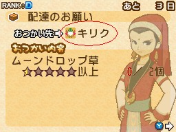
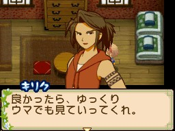

[[此花村]]（このはな村）的村長家、種子屋等相關角色會在告示板（掲示板）發布委託任務。接取任務後，攜帶指定物品找委託人對話即完成。

## 任務機制

- **接取方式**：到告示板查看並接受委託
- **完成方式**：帶著任務物品，跟委託人對話即可
- **物品隨機**：任務的內容物品都是隨機的
- **任務物品類型**：任務通常都只是採集物、農作物、副產品、魚類、昆蟲、料理、製造機的物品等
- **等級**：D（最低）→ C → B → A → S（最高），難度與報酬均遞增
- **不強求**：普通任務都是反覆出現的，如果任務出現不知道的任務物品不需要勉強接下來
- **探し物（尋物任務）**：特定日期才會出現的限定委託，需在該日期帶指定物品前往

本文涵蓋五位委託角色：[[此花村-奇利克|奇利克]]、[[此花村-娜娜|娜娜]]、[[此花村-古恩貝|古恩貝]]、[[此花村-琉伊|琉伊]]、[[此花村-伊爾薩|伊爾薩]]。

---

## 奇利克（キリク）

### RANK D

| 任務名 | 所需物品 | 主要報酬 |
|--------|----------|----------|
| 魚つかみのコツ（釣魚技巧） | 小種香魚（チビアユ）☆0.5以上×1、鱂魚（メダカ）☆0.5以上×1 | 魚糕 |
| ハヤテのため！（為了疾風） | 石材☆0.5以上×1～2、梅子（うめ）☆0.5以上×1～2、白菜☆0.5以上×3、大根☆0.5以上×2 | 150G、寵物飼料 |
| お月見サイコー！（賞月最高） | 小種西太公魚（チビワカサギ）☆0.5以上×2、小種紅點鮭（チビイワナ）☆0.5以上×2、虎魚（ハゼ）☆0.5以上×2、西太公魚（ワカサギ）☆0.5以上×2、鯉魚（コイ）☆0.5以上×1 | — |

### RANK C

| 任務名 | 所需物品 | 主要報酬 |
|--------|----------|----------|
| ハヤテのため！ | 桃子（もも）☆1.0以上×4、石材☆0.5以上×2、洋蔥（たまねぎ）☆0.5以上×2、鱂魚☆1.0以上×4 | 450G、寵物飼料 |
| お月見サイコー！ | 銀魚（シラウオ）☆0.5以上×3、藍鰓太陽魚（ブルーギル）☆1.0以上×3 | — |
| ごはんの一品（飯菜逸品） | 荷包蛋（目玉焼き）☆1.0以上×3 | — |

### RANK B

| 任務名 | 所需物品 | 主要報酬 |
|--------|----------|----------|
| お月見サイコー！ | 河蟹（サワガニ）☆1.0以上×4、鯉魚☆1.0以上×4、虎魚☆1.0以上×5、大種鱸魚（デカバス）☆1.0以上×5、柳葉魚（シシャモ）☆1.0以上×5、香魚（アユ）☆1.0以上×4 | 680G、寵物飼料 |
| 探し物（春2日） | 白色摩爾佛蝶（シロモルフォ）×1、蜂蜜（ハチミツ）☆1.0以上×1 | 100G、牧草、動物茶點 |
| 探し物（夏16日） | 紅玫瑰（レッドローズ）☆1.0以上×1、向日葵（ひまわり）☆1.0以上×1 | 1000G、牧草、野菜茶點 |

### RANK A

| 任務名 | 所需物品 | 主要報酬 |
|--------|----------|----------|
| お月見サイコー！ | 藍色河蟹（アオサワガニ）☆1.5以上×5、小種鱂魚（チビメダカ）☆1.5以上×5、虎魚☆1.5以上×1、西太公魚☆1.5以上×1 | 2100G、動物茶點、肥料 |
| ごはんの一品 | 蛋捲（オムレツ）☆1.5以上×1、烤蘑菇（焼ききのこ）☆1.5以上×1、生魚片（刺身）☆1.5以上×6、義式炸飯糰（アランチーニ）☆1.5以上×6 | — |
| ハヤテのため！ | 竹筍（たけのこ）☆1.5以上×6、土豆（じゃがいも）☆1.5以上×5、石材☆1.5以上×6、木材☆1.5以上×6 | — |

### RANK S

| 任務名 | 所需物品 | 主要報酬 |
|--------|----------|----------|
| ハヤテのため！ | 石材☆2.0以上×7、木材☆2.0以上×6 | 3000G、動物點心、肥料 |
| お月見サイコー！ | 白菜泡菜（はくさいのつけもの）☆2.5以上×8、朝鮮混合泡菜（キムチつめ合わせ）☆2.5以上×8、白菜辛奇（はくさいのキムチ）☆2.5以上×7、白菜泡菜☆2.5以上×7 | — |

---

## 娜娜（ナナ）

種屋助手。

### RANK D

| 任務名 | 所需物品 | 主要報酬 |
|--------|----------|----------|
| わけてほしいの（想要分享） | 棕色蘑菇（ブラウンマッシュ）☆0.5以上×2、胡桃（くるみ）×1、白菜☆0.5以上×3 | 223G、綠茶 |

### RANK C

| 任務名 | 所需物品 | 主要報酬 |
|--------|----------|----------|
| お酒のおともに（酒的伴侶） | 梅子☆1.0以上×4、藍莓（ブルーベリー）☆1.0以上×3 | 523G、綠茶 |
| わけてほしいの | 雞蛋☆1.0以上×3、棕色蘑菇☆1.0以上×4 | — |
| 仕立て屋より（裁縫師傅） | 羊毛☆0.5以上×2 | 10000G、工作女裝／工作男裝；另需羊毛☆0.5以上×2 → 30000G、日常女裝／日常男裝 |

### RANK B

| 任務名 | 所需物品 | 主要報酬 |
|--------|----------|----------|
| わけてほしいの | 好羊毛（いい羊毛）☆1.5以上×6、毛線團（毛糸玉）☆1.5以上×5、毛線團☆1.0以上×4、薩福克毛線團（サフォーク毛糸玉）☆1.0以上×4 | 450G、黃瓜種子 |
| こはんをあ願い（飯食請求） | 蒸蛋（茶碗むし）☆1.0以上×5、烤飯糰（焼きおにぎり）☆1.0以上×5、炒麵（焼きそば）、豆漿（豆乳） | — |
| バイトぼしゅう！（打工招募，19:00前完成） | 澆水（畑の水まき） | 100G、豆腐漢堡／豆腐沙拉 |
| バイトぼしゅう！（同上） | 收穫（作物のしゅうかく） | 500G、大豆種子 |
| 探し物（冬3日） | 筆管麵（ペンネパスタ）☆1.5以上×1、奶酪（チーズ）☆1.5以上×1 | 100G、小麥粉、白菜種子 |
| 探し物（冬20日） | 生魚片☆1.5以上×3 | 100G、小麥粉、草莓種子 |
| 探し物（冬25日） | 豆腐☆1.5以上×1 | 100G、小麥粉、黃瓜種子 |
| 仕立て屋より | 好羊毛☆1.0以上×2 | 60000G、冷酷魅力女裝／城市狂野男裝 |

### RANK A

| 任務名 | 所需物品 | 主要報酬 |
|--------|----------|----------|
| わけてほしいの | 上等香草黃油（上ハーブバター）☆2.0以上×7、玫瑰茶罐（ローズティー缶）☆2.0以上×7、雞蛋☆2.0以上×7、蕪菁（かぶ）☆2.0以上×7、薩福克毛線團☆2.0以上×6、羊毛☆2.0以上×6、煎茶罐（せん茶缶）☆1.5以上×5、棕色蘑菇☆1.5以上×6、好羊毛☆2.5以上×8、毛線團☆2.5以上×8 | 2880G、黃瓜種子、白菜種子 |
| こはんをあ願い | 朝鮮混合泡菜☆2.0以上×7、炸豆皮（油あげ）☆2.0以上×7 | — |
| お酒のおともに | 朝鮮混合泡菜☆1.5以上×6、黃瓜泡菜（きゅうりのつけもの）☆1.5以上×6、梅子☆1.5以上×6、桃子☆1.5以上×6、櫻桃（さくらんぼ）☆2.5以上×7、草莓（いちご）☆2.5以上×7 | — |

### RANK S

| 任務名 | 所需物品 | 主要報酬 |
|--------|----------|----------|
| わけてほしいの | 薩福克毛線團☆2.5以上×7、毛線團☆2.5以上×7、掃帚菇（ホウキタケ）☆2.0以上×6、藍莓☆2.0以上×7 | 2830G、黃瓜種子、白菜種子、地瓜種子 |
| お酒のおともに | 白辛奇（白キムチ）☆2.0以上×7、醃菜拼盤（ピクルスつめ合わせ）☆2.0以上×7、蘿蔔泡菜（だいこんのつけもの）☆2.5以上×7、櫻桃蘿蔔醃菜（ラディッシュピクルス）☆2.5以上×8 | — |

---

## 古恩貝（ゴンベ）

種子店老闆。

### RANK D

| 任務名 | 所需物品 | 主要報酬 |
|--------|----------|----------|
| 虫つかみのコツ（捉蟲技巧） | 負蝗（オンブバッタ）×1 | 蕪菁種子 |
| ジャンプ虫のつかみ（跳躍蟲捉法） | 紋白蝶（モンシロチョウ）×1 | 米粉 |
| 『うた』をたしなむ（歌唱修養） | 短角蝗（ハラヒシバッタ）×2、紫蝶（ムラサキタテハ）×2、大絹斑蝶（オオゴマダラ）×1、燕尾蝶（アゲハチョウ）×1、土蝗（ツチイナゴ）×1 | 150G、小麥粉 |
| うまし『かて』！（美味飼料） | 河蟹☆0.5以上×2、小種紅點鮭☆0.5以上×2、柳葉魚☆0.5以上×2 | — |

### RANK C

| 任務名 | 所需物品 | 主要報酬 |
|--------|----------|----------|
| たまにはわしが（偶爾我來） | 烤蘑菇☆1.0以上×5、蕃茄沙拉（トマトサラダ）☆1.0以上×3、辣炒年糕（トッポギ）☆1.0以上×4、荷包蛋☆1.0以上×4 | 450G、小麥粉 |
| ナナにはナイショ（對娜娜保密） | 布丁（プリン）☆1.0以上×5 | — |
| 『うた』をたしなむ | 黃蝶（モンキチョウ）×3、飴色蜻蜓（アメイロトンボ）×3、蟋蟀（コオロギ）×3、紅蜻蜓（アカトンボ）×3 | — |
| うまし『かて』！ | 河蟹☆0.5以上×3、小種虎魚（チビハゼ）☆1.0以上×3、柳葉魚☆0.5以上×3 | — |

### RANK B

| 任務名 | 所需物品 | 主要報酬 |
|--------|----------|----------|
| うまし『かて』！ | 虎魚☆1.0以上×4、河蟹☆1.0以上×5、小種鱒魚（チビマス）☆1.0以上×5、洋蔥泡菜（たまねぎピクルス）☆1.0以上×4、鱒魚（マス）☆1.0以上×5、藍色河蟹☆1.0以上×5 | 430G、小麥粉、蕎麥粉 |
| 『うた』をたしなむ | 姬螢（オバボタル）×4、斑紋蝗（マダラバッタ）×3～5、短角蝗×5、紅蜻蜓×4、寬腹蜻蜓（ハラビロトンボ）×3 | — |
| 探し物（春24日） | 白玉粉☆1.0以上×1 | 200G、蕎麥種子、洋蔥種子、水蘿蔔種子 |
| バイトぼしゅう！（19:00前完成） | 收穫（作物のしゅうかく） | 250G、胡蘿蔔種子／400G、包心菜種子／500G、蕃茄種子（三選一） |
| バイトぼしゅう！（同上） | 澆水（畑の水まき） | 100G、炒食蔬／100G、日式沙拉／100G、醃蘿蔔（三選一） |

### RANK A

| 任務名 | 所需物品 | 主要報酬 |
|--------|----------|----------|
| たまにはわしが | 納豆☆1.0以上×5、白辛奇☆1.0以上×5 | 2280G、小麥粉、蕎麥粉、地瓜種子 |
| うまし『かて』！ | 小種鱒魚☆1.5以上×6、小種柳葉魚（チビシシャモ）☆1.5以上×5 | — |
| ナナにはナイショ | 奶酪生日蛋糕（チーズホールケーキ）☆2.5以上×8、草莓冰淇淋（いちごアイス）☆2.5以上×8 | — |

### RANK S

| 任務名 | 所需物品 | 主要報酬 |
|--------|----------|----------|
| ナナにはナイショ | 蛋撻（エッグタルト）☆2.5以上×8、巧克力餅乾（チョコクッキー）☆2.5以上×8、巧克力甜甜圈（チョコドーナッツ）☆2.5以上×8、水果奶酪（トライフル）☆2.5以上×7 | 2000G、小麥粉、蕎麥粉、菠蘿種子 |
| うまし『かて』！ | 柳葉魚☆2.5以上×8、帶子柳葉魚（コモチシシャモ）☆2.5以上×8 | — |
| たまにはわしが | 櫻桃蘿蔔醃菜☆2.5以上×7、水煮蛋（ゆで卵）☆2.5以上×8 | — |
| 『うた』をたしなむ | 姬春蟬（ヒメハルゼミ）×9、鈴蟲（クツワムシ）×9、蟋蟀×8、月淚草（ムーンドロップ草）☆2.5以上×8 | — |

---

## 琉伊（リュイ）

學生。

### RANK D

| 任務名 | 所需物品 | 主要報酬 |
|--------|----------|----------|
| 花をください（給我花） | 月淚草☆0.5以上×4、薄荷（ミント）☆1.0以上×2、甘菊（カモミール）×2、薰衣草（ラベンダー）☆0.5以上×2、魔術紅草（マジックレッド草）☆0.5以上×3 | 硬幣（コイン） |

### RANK C

| 任務名 | 所需物品 | 主要報酬 |
|--------|----------|----------|
| 花をください | 紅瞿麥（なでしこ）☆1.0以上×4、延命菊（マーガレット）☆1.0以上×4、向日葵☆1.0以上×4、薄荷☆1.0以上×4 | 洋蔥 |
| お菓子をください（給我糕點） | 布丁☆1.0以上×5 | — |

### RANK B

| 任務名 | 所需物品 | 主要報酬 |
|--------|----------|----------|
| 花をください | 粉紅玫瑰（ピンクローズ）☆1.5以上×6、卡薩布蘭卡（カサブランカ）☆1.5以上×6 | 洋蔥 |
| ひみつのおねがい（秘密請求） | 朝鮮混合泡菜☆1.0以上×5、櫻桃蘿蔔醃菜☆1.0以上×5、黃瓜泡菜（きゅうりピクルス）☆1.0以上×4、魚板（かまぼこ）☆1.0以上×4 | — |
| お菓子をください | 草餅（草もち）☆1.0以上×5、熔岩巧克力蛋糕（フォンダンショコラ）☆1.0以上×4 | — |
| ごはんをおねがい（飯食請求） | 泡菜鍋（キムチチゲ）☆1.0以上×4、法式薄餅（ガレット）☆1.0以上×5、白菜辛奇☆1.0以上×4、香草沙拉（ハーブサラダ）☆1.0以上×5 | — |
| 探し物（冬18日） | 米粉☆1.0以上×1 | 140G、硬幣、豆腐 |
| 探し物（夏2日） | 普洱茶（プーアル茶）☆2.0以上×1 | 100G、硬幣、小種翻車魚 |

### RANK A

| 任務名 | 所需物品 | 主要報酬 |
|--------|----------|----------|
| 花をください | 魔術紅草☆1.5以上×5、薰衣草☆1.5以上×5、甘菊☆1.5以上×5、月淚草☆1.5以上×5、薰衣草☆1.5以上×5、紅瞿麥☆1.5以上×6 | 紅寶石 |
| ごはんをおねがい | 白菜辛奇☆1.5以上×5、櫻桃蘿蔔醃菜☆1.5以上×6 | — |
| お菓子をください | 水果白玉（フルーツ白玉）☆1.5以上×5、布丁☆1.5以上×6、巧克力餅乾☆1.5以上×5、水果白玉☆1.5以上×5 | — |

### RANK S

| 任務名 | 所需物品 | 主要報酬 |
|--------|----------|----------|
| 花をください | 紅玫瑰☆2.0以上×7、向日葵☆2.0以上×6 | 鑽石（ダイヤ） |
| お菓子をください | 櫻桃派（さくらんぼパイ）☆3.0以上×9、草莓派（ストロベリーパイ）☆3.0以上×9 | — |
| ごはんをおねがい | 豆皮壽司（いなりずし）☆3.0以上×8、白菜辛奇☆3.0以上×8 | — |

---

## 伊爾薩（イルサ）

官員。

### RANK D

| 任務名 | 所需物品 | 主要報酬 |
|--------|----------|----------|
| このはな村の生活（此花村的生活） | 蕪菁種子、土豆種子 | 1500G、收音機（ラジオ） |
| 配達のお願い（配達請求，每次隨機出現以下其中一項） | 藍鰓太陽魚☆0.5以上×4、鯉魚☆0.5以上×2、帶子柳葉魚☆0.5以上×2、小種泥鰍（チビドジョウ）☆0.5以上×2、胡桃☆0.5以上×1、雞蛋×1、硬幣×2、鱂魚☆0.5以上×2、柳葉魚☆0.5以上×3、小種柳葉魚☆0.5以上×1、小種河蟹（チビサワガニ）☆0.5以上×2、甘菊☆0.5以上×1、薄荷☆0.5以上×2、竹筍☆0.5以上×1、月淚草☆0.5以上×1、梅子☆0.5以上×1、水蘿蔔（ラディッシュ）☆0.5以上×2、大根☆0.5以上×3、河蟹☆0.5以上×2、小種鱒魚☆0.5以上×1、羊毛☆0.5以上×3、掃帚菇☆0.5以上×3、蕃茄☆0.5以上×2、白菜☆0.5以上×3、鴻喜菇（しめじ）☆0.5以上×1、香菇（しいたけ）☆0.5以上×2、杏鮑菇（エリンギ）☆0.5以上×2、胡桃☆0.5以上×3 | 120G、海苔 |
| 作物をくれ（給我作物） | 物品隨機，來源未列出清單 | — |

### RANK C

| 任務名 | 所需物品 | 主要報酬 |
|--------|----------|----------|
| 配達のお願い（每次隨機出現以下其中一項） | 向日葵☆0.5以上×2、蘆筍（アスパラ）☆1.0以上×3、蕃茄沙拉☆1.0以上×3、山女鱒（ヤマメ）☆0.5以上×3、鯉魚☆0.5以上×3、小種鱂魚☆1.0以上×4、小種銀魚（チビシラウオ）☆0.5以上×3、小麥☆1.0以上×4、杏子（あんず）☆0.5以上×3、掃帚菇☆0.5以上×2、月淚草☆0.5以上×3、虎魚☆1.0以上×3、鴻喜菇☆0.5以上×3、硬幣×3、銀魚☆0.5以上×3 | 420G、海苔 |
| 作物をくれ（每次隨機出現以下其中一項） | 竹筍☆1.0以上×5、洋蔥☆0.5以上×2、棕色蘑菇☆0.5以上×3、掃帚菇☆0.5以上×2、鴻喜菇☆0.5以上×2、胡桃☆1.0以上×3、南瓜☆1.0以上×3 | — |
| ごはんをお願い（每次隨機出現以下其中一項） | 日式沙拉（和風サラダ）☆1.0以上×3、烤蘑菇☆1.0以上×4、烤魚（焼き魚）☆1.0以上×4 | — |

### RANK B

| 任務名 | 所需物品 | 主要報酬 |
|--------|----------|----------|
| ごはんをお願い（每次隨機出現以下其中一項） | 至高咖哩（至高のカレー）☆1.0以上×4、蟹肉鍋（かになべ）☆1.0以上×4、荷包蛋☆1.0以上×5、白菜泡菜☆1.0以上×5 | 400G、海苔、咖哩粉 |
| 作物をくれ（每次隨機出現以下其中一項） | 竹筍☆1.0以上×5、黃瓜☆1.0以上×5、蕎麥☆1.0以上×4、白菜☆1.0以上×5 | — |
| 配達のお願い（每次隨機出現以下其中一項） | 粽子（ちまき）☆1.0以上×5、抹茶冰淇淋（まっ茶アイス）☆1.0以上×5、棕色蘑菇☆1.5以上×5、鱒魚☆1.5以上×6、小麥☆1.0以上×4、柳葉魚☆1.0以上×4、黑鱸魚（ブラックバス）☆1.0以上×4、大種香魚（デカアユ）☆1.0以上×4、小種虎魚☆1.0以上×5、小種泥鰍☆1.0以上×4、蘆筍種子☆1.0以上×4、湯麵義大利麵（スープスパゲッティ）☆1.0以上×4 | — |
| 探し物（秋14日） | 澤西牛奶（ジャージーミルク）☆1.5以上×5 | 1620G、口蘑、香菇、香料 |

### RANK A

| 任務名 | 所需物品 | 主要報酬 |
|--------|----------|----------|
| 作物をくれ（每次隨機出現以下其中一項） | 蕎麥☆1.5以上×5、黃瓜☆1.5以上×5、胡蘿蔔☆1.5以上×5、掃帚菇☆1.5以上×5、玉米☆1.5以上×5、蕃茄☆1.5以上×5 | 2400G、海苔、咖哩粉、香料 |
| 配達のお願い（每次隨機出現以下其中一項） | 鱂魚☆2.0以上×7、西太公魚☆2.0以上×7、小種紅點鮭☆2.0以上×7、蘆筍種子☆2.0以上×7、巧克力餅乾☆1.5以上×5、司康（スコーン）☆1.5以上×6、雞蛋☆1.5以上×5、藍鰓太陽魚☆1.5以上×5、小種鰻魚（チビウナギ）☆1.5以上×5、藍莓☆1.5以上×6 | — |

### RANK S

| 任務名 | 所需物品 | 主要報酬 |
|--------|----------|----------|
| 配達のお願い（每次隨機出現以下其中一項） | 夏茶葉☆2.5以上×8、薄荷☆2.5以上×8、香魚☆2.5以上×7、鱸魚（スズキ）☆2.5以上×8、藍玫瑰種子（ブルーローズの種）☆2.5以上×7、香草美乃滋（ハーブマヨネーズ）☆2.5以上×7、魔術紅草☆2.0以上×7、泰式酸辣湯（トムヤムクン）☆2.0以上×6、河蟹☆3.0以上×8、蕪菁☆3.0以上×9 | 3300G、海苔、咖哩粉、香料 |
| 作物をくれ（每次隨機出現以下其中一項） | 胡桃☆2.0以上×6、白菜☆2.0以上×6 | — |

---

## 相關

- [[藍鈴村任務系統]] — 藍鈴村動物屋・馬屋組任務攻略
- [[藍鈴村村民任務]] — 藍鈴村村長家組任務攻略
- [[藍鈴村雜貨店木匠神父任務]] — 藍鈴村雜貨店・木匠・神父組任務攻略
- [[此花村-奇利克]] — 奇利克角色條目
- [[此花村-娜娜]] — 娜娜角色條目
- [[此花村-古恩貝]] — 古恩貝角色條目
- [[此花村-琉伊]] — 琉伊角色條目
- [[此花村-伊爾薩]] — 伊爾薩角色條目

## 來源

- [NDS 牧場物語-雙子村 「此花村」村長家、種子屋、奇利克的任務](https://leomoon173.pixnet.net/blog/posts/5010970412)，擷取於 2026-07-03
