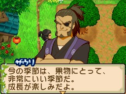

[[此花村]]（このはな村）的果樹園、食堂、雜貨店等相關角色會在告示板（掲示板）發布委託任務。接取任務後，攜帶指定物品找委託人對話即完成。

## 任務機制

- **接取方式**：到告示板查看並接受委託
- **完成方式**：帶著任務物品，跟委託人對話即可
- **物品隨機**：任務的內容物品都是隨機的
- **任務物品類型**：任務通常都只是採集物、農作物、副產品、魚類、昆蟲、料理、製造機的物品等
- **等級**：D（最低）→ C → B → A → S（最高），難度與報酬均遞增
- **不強求**：普通任務都是反覆出現的，如果任務出現不知道的任務物品不需要勉強接下來
- **探し物（尋物任務）**：特定日期才會出現的限定委託，需在該日期帶指定物品前往
- **☆ 星等**：表示道具品質等級，☆0.5、☆1.0、☆1.5、☆2.0、☆2.5、☆3.0

本文涵蓋五位委託角色：[[此花村-札烏利|札烏利]]（果樹園主）、[[此花村-莉可麗絲|莉可麗絲]]（果樹園助手）、[[此花村-索娜|索娜]]（餐廳老闆）、[[此花村-瑪奧|瑪奧]]（學生）、[[此花村-穆喬|穆喬]]（農夫見習）。

---

## 札烏利（ザウリ）

### RANK D

| 任務名 | 所需物品 | 主要報酬 |
|--------|----------|----------|
| 何がいけない!?（哪裡不對!?） | 黎氏紅蜻蜓（リスアカネ）☆×2、日本羊角蚱（トゲヒシバッタ）☆×2、蟋蟀（コオロギ）☆×1、燕尾蝶（アゲハチョウ）☆×1、黃蝶（モンキチョウ）☆×1、大絹斑蝶（オオゴマダラ）☆×2、豹紋蝶（ヒョウモンチョウ）☆×2、斑紋蝗（マダラバッタ）☆×2 | 223G、綠茶 |
| 究極のひりょう!?（究極的肥料!?） | 失敗作☆×1～2 | 料理的失敗品 |
| わけてくれ!（分我一點!） | 月淚草（ムーンドロップ草）☆0.5以上×1、魔術紅草（マジックレッド草）☆0.5以上×3、薰衣草（ラベンダー）☆0.5以上×2 | — |

### RANK C

| 任務名 | 所需物品 | 主要報酬 |
|--------|----------|----------|
| 何がいけない!? | 斑紋蝗☆×3、紅眼樹蛙（アカメアマガエル）☆×4、日本鐘蟋（エンマコオロギ）☆×3、短角蝗（ショウリョウバッタ）☆×4 | 515G、抹茶 |
| わけてくれ! | 薄荷（ミント）☆0.5以上×3、白玫瑰（ホワイトローズ）☆1.0以上×4 | — |
| 究極のひりょう!? | 失敗作☆×3 | 料理的失敗品 |

### RANK B

| 任務名 | 所需物品 | 主要報酬 |
|--------|----------|----------|
| 究極のひりょう！？ | 失敗作☆×4～6、胡桃（クルミ）☆1.0以上×4、桃子種子、大根☆1.0以上×5、杏子（あんず）☆1.0以上×4、地瓜（さつまいも）☆1.0以上×4、土豆（じゃがいも）☆2.0以上×7 | 335G、蕎麥茶 |
| 何がいけない!? | 南洋大甲蟲（アトラスオオカブト）☆×4、大鍬形蟲（オオクワガタ）☆×4、短角蝗☆×6、土蝗（ツチイナゴ）☆×6 | — |
| わけてくれ! | 月淚草☆1.5以上×6、延命菊（マーガレット）☆1.5以上×5 | — |
| バイトぼしゅう！（打工招募，19:00前完成） | 果物のしゅうかく（採收水果） | 700G、香蕉種子／670G、葡萄種子／410G、橘子種子／880G、咖啡種子（四選一） |
| 探し物（秋28日） | 烏龍茶罐（ウーロン茶缶）☆1.0以上×1 | 100G、蘋果 |

### RANK A

| 任務名 | 所需物品 | 主要報酬 |
|--------|----------|----------|
| 何がいけない!? | 姬螢（オバボタル）☆×6、麻屋白兜蟲（マヤシロカブト）☆×6 | 2955G、桃子種子、人參茶 |
| 究極のひりょう！？ | 失敗作☆×6 | 料理的失敗品 |
| わけてくれ! | 薄荷☆1.5以上×6、魔術藍草（マジックブルー草）☆1.5以上×5 | — |

### RANK S

| 任務名 | 所需物品 | 主要報酬 |
|--------|----------|----------|
| わけてくれ! | 龍膽花（りんどう）☆2.0以上×6、薰衣草☆2.0以上×6、向日葵（ひまわり）☆2.0以上×7、魔術藍草☆2.0以上×7 | 2130G、桃子種子、咖啡種子、可可樹種子 |
| 何がいけない!? | 紅蜻蜓（アカトンボ）☆×6、斑紋蝗☆×7、蟪蛄（ハルゼミ）☆×9、大絹斑蝶☆×8 | — |
| 夜食をたのむ（拜託宵夜） | 小黃瓜涼拌（きゅうりのナムル）☆2.5以上×8、醃菜拼盤（ピクルスつめ合わせ）☆2.5以上×8 | — |
| 究極のひりょう！？ | 失敗作☆×6～8、小麥☆3.0以上×8、胡桃☆2.5以上×8、掃帚菇（ホウキタケ）☆2.5以上×7、香菇（しいたけ）☆2.5以上×7 | 料理的失敗品 |

---

## 莉可麗絲（リコリス）

### RANK D

| 任務名 | 所需物品 | 主要報酬 |
|--------|----------|----------|
| 山の幸(さち)（山中恩惠） | 薄荷☆0.5以上×1、甘菊（カモミール）☆0.5以上×1 | 薰衣草 |
| 研究のため（為了研究） | 石材☆0.5以上×2、月淚草☆0.5以上×2、魔術紅草☆0.5以上×2、甘菊☆0.5以上×2 | 262G、藍莓醬 |
| 恥をしのんで…（忍辱之下…） | 藍鰓太陽魚（ブルーギル）☆0.5以上×2、小種鱸魚（チビスズキ）☆0.5以上×3、小種西太公魚（チビワカサギ）☆0.5以上×2、河蟹（サワガニ）☆0.5以上×3、小種鯉魚（チビコイ）☆0.5以上×2、小種香魚（チビアユ）☆0.5以上×2、香魚（アユ）☆0.5以上×3、銀魚（シラウオ）☆0.5以上×2、山女鱒（ヤマメ）☆0.5以上×2 | — |

### RANK C

| 任務名 | 所需物品 | 主要報酬 |
|--------|----------|----------|
| 研究のため | 石材☆1.0以上×3、向日葵☆0.5以上×3、魔術紅草☆1.0以上×3、紅玫瑰（レッドローズ）☆0.5以上×3 | 562G、藍莓醬 |
| 恥をしのんで… | 小種河蟹（チビサワガニ）☆0.5以上×2、河蟹☆0.5以上×2、黑鱸魚（ブラックバス）☆1.0以上×3、藍鰓太陽魚☆1.0以上×3、小種虎魚（チビハゼ）☆1.0以上×3 | — |
| 夜食を頼む（拜託宵夜） | 蕃茄沙拉（トマトサラダ）☆1.0以上、日式沙拉（和風サラダ）☆1.0以上×3 | — |

### RANK B

| 任務名 | 所需物品 | 主要報酬 |
|--------|----------|----------|
| 探し物（春23日） | 鴻喜菇（しめじ）☆1.0以上×1、香菇☆1.0以上×1、胡蘿蔔（にんじん）☆1.0以上×1 | 515G、蜜桃、紫葡萄種子 |
| 探し物（春5日） | 白色摩爾佛蝶（シロモルフ）☆×1、大黃粉蝶（オオキチョウ）☆×1、海倫娜摩爾佛蝶（ヘレナモルフォ）☆×1 | 660G、蜜桃、蘋果種子 |
| 探し物（春19日） | 洋蔥（たまねぎ）☆×1、牛奶（ミルク）☆×1 | 370G、香蕉、橘子種子 |

### RANK A

| 任務名 | 所需物品 | 主要報酬 |
|--------|----------|----------|
| 研究のため | 石材☆1.5以上×6、樹枝☆1.5以上×5、藍玫瑰種子（ブルーローズの種）☆1.5以上×6、卡薩布蘭卡（カサブランカ）☆1.5以上×6 | 3097G、藍莓醬、蘋果醬、草莓醬 |
| 夜食を頼む | 蒸蛋（茶碗むし）☆1.5以上×5、蛋花湯（卵スープ）☆1.5以上×6 | — |

### RANK S

| 任務名 | 所需物品 | 主要報酬 |
|--------|----------|----------|
| 恥をしのんで… | 黑鱸魚☆2.5以上×7、鯽魚（フナ）☆2.5以上×8、小種銀魚（チビシラウオ）☆2.0以上×6、小種鰻魚（チビウナギ）☆2.0以上×7 | 3997G、藍莓醬、蘋果醬、草莓醬 |
| 研究のため | 石材☆2.0以上×6、樹枝☆2.0以上×6、稻苗（お米の苗）☆2.0以上×7、蕎麥種子（そばの種）☆2.0以上×7 | — |
| 夜食を頼む | 燉煮馬鈴薯（いもの煮っ転がし）☆3.0以上×8、蕪菁醃菜（かぶのつけもの）☆3.0以上×9、香菇義大利麵（きのこパスタ）☆3.0以上×8、豆腐漢堡（豆腐バーガー）☆3.0以上×8 | — |

---

## 索娜（ソナ）

### RANK D

| 任務名 | 所需物品 | 主要報酬 |
|--------|----------|----------|
| 新メニュー開発（新菜單開發） | 杏鮑菇（エリンギ）☆0.5以上×1、棕色蘑菇（ブラウンマッシュ）☆0.5以上×1、雞蛋☆0.5以上×1、鴻喜菇☆0.5以上×2、雞蛋☆0.5以上×3、掃帚菇☆0.5以上×2 | 275G、短種鰻魚 |

### RANK C

| 任務名 | 所需物品 | 主要報酬 |
|--------|----------|----------|
| 新メニュー開発 | 胡桃☆1.0以上×5、蘆筍（アスパラ）☆0.5以上×4、鴻喜菇☆0.5以上×2、牛奶☆1.0以上×4 | 575G、短種鰻魚 |
| 一品どう？（來一道菜如何？） | 水煮蛋（ゆで卵）☆1.0以上×4、荷包蛋（目玉焼き）☆1.0以上×5 | — |
| 料理とは…（所謂料理…） | 水煮蛋☆0.5以上×1 | 5000G、平底鍋（廚具） |

### RANK B

| 任務名 | 所需物品 | 主要報酬 |
|--------|----------|----------|
| 新メニュー開発 | 大豆☆1.0以上×4、香草美乃滋（ハーブマヨネーズ）☆1.0以上×5、雞蛋☆1.0以上×4、包心菜（きゃべつ）☆1.0以上×5、藍莓☆1.0以上×4、雞蛋☆1.0以上×4、土豆☆2.0以上×6、包心菜☆2.0以上×7 | 540G、鰻魚 |
| 一品どう？ | 梅乾（うめぼし）☆1.0以上×4、洋蔥泡菜（たまねぎピクルス）☆1.0以上×4、燉魚（魚の煮付け）☆1.0以上×3、香草沙拉（ハーブサラダ）☆1.0以上×4 | — |
| デザ－ト研究（甜點研究） | 司康（スコーン）☆2.0以上×7、巧克力甜甜圈（チョコドーナッツ）☆2.0以上×8 | — |
| 探し物（冬27日） | 玫瑰蜂蜜（バラのハチミツ）☆1.0以上×2 | 罐裝巧克力 |

### RANK A

| 任務名 | 所需物品 | 主要報酬 |
|--------|----------|----------|
| 昔なじみ（老朋友） | 玫瑰酒（ローズワイン）☆1.5以上×5、啤酒（ビール）☆1.5以上×5、葡萄酒（ワイン）☆1.5以上×5、夏風之酒（夏風のワイン）☆1.5以上×6 | 2290G、比目魚、鱸魚 |
| 新メニュー開発 | 竹筍（たけのこ）☆1.5以上×6、雞蛋☆1.5以上×6、香蕉（バナナ）☆1.5以上×6、夏茶葉☆1.5以上×5、竹筍☆2.0以上×6、春茶葉☆2.0以上×7、蕎麥粉（そば粉）☆1.5以上×5、蕎麥（そば）☆1.5以上×6、棕色蘑菇☆2.5以上×8、蕪菁（かぶ）☆2.5以上×7 | — |
| デザ－ト研究 | 冰淇淋（アイスクリーム）☆2.0以上×6、年輪蛋糕（バウムクーヘン）☆2.0以上×7、巧克力甜甜圈☆2.0以上×6、冰淇淋☆2.0以上×6 | — |

### RANK S

| 任務名 | 所需物品 | 主要報酬 |
|--------|----------|----------|
| デザ－ト研究 | 蛋糕（ケーキ）☆2.0以上×7、蛋撻（エッグタルト）☆2.0以上×6、巧克力鍋（チョコフォンデュ）☆2.0以上×6、提拉米蘇（ティラミス）☆2.0以上×6、蜂蜜蛋糕（ハチミツケーキ）☆2.5以上×8、提拉米蘇☆2.5以上×7 | 2190G、鱸魚、鰹魚、金槍魚 |
| 昔なじみ | 啤酒☆2.5以上×7、四季調酒（グラスワイン四季）☆2.5以上×7、葡萄酒☆2.0以上×6、紅酒調酒（グラスワイン赤）☆2.0以上×7、奇恰酒（グラスチチャ）☆2.0以上×7 | — |
| 新メニュー開発 | 極品果實優格（極果実ヨーグルト）☆2.0以上×7、極品美乃滋（極マヨネーズ）☆2.0以上×6 | — |

---

## 瑪奧（マオ）

### RANK D

| 任務名 | 所需物品 | 主要報酬 |
|--------|----------|----------|
| お手紙に…（寫信用…） | 薄荷☆0.5以上×3、甘菊☆0.5以上×3、魔術藍草☆0.5以上×1、月淚草☆0.5以上×1、薰衣草☆0.5以上×3 | 竹子 |
| おっきいパンダさん（大貓熊先生） | 草莓（いちご）☆0.5以上×3、杏子☆0.5以上×1、梅子（うめ）☆0.5以上×2、藍莓☆0.5以上×2 | — |
| ちっさいパンダさん（小貓熊先生） | 羊毛☆0.5以上×3 | — |

### RANK C

| 任務名 | 所需物品 | 主要報酬 |
|--------|----------|----------|
| おっきいパンダさん | 草莓☆1.0以上×4、橘子（みかん）☆1.0以上×3、藍莓☆1.0以上×3 | 竹子 |
| ごはんをおねがい（拜託飯食） | 納豆☆1.0以上×3、香菇鋁箔蒸（きのこのホイルむし）☆1.0以上×3、豆漿（豆乳）☆0.5以上×2、蕪菁沙拉（かぶのサラダ）☆1.0以上×3 | — |
| お手紙に… | 薰衣草☆1.0以上×3、雪花蓮（スノードロップ）☆0.5以上×2 | — |
| ちっさいパンダさん | 羊毛☆0.5以上×2 | — |

### RANK B

| 任務名 | 所需物品 | 主要報酬 |
|--------|----------|----------|
| お手紙に… | 雪花蓮☆1.0以上×4、龍膽花☆1.0以上×4、薄荷☆1.5以上×6、卡薩布蘭卡☆1.5以上×6、薰衣草☆1.0以上×4、雪花蓮☆1.0以上×5、紅瞿麥（なでしこ）☆1.0以上×4、魔術紅草☆1.0以上×5、紅玫瑰☆1.0以上×5、魔術藍草☆1.0以上×5、薰衣草☆1.0以上×4、龍膽花☆1.0以上×5 | 竹子 |
| ちっさいパンダさん | 薩福克毛線團（サフォーク毛糸玉）☆1.0以上×4、毛線團（毛糸玉）☆1.0以上×5 | — |
| ごはんをおねがい | 燉煮馬鈴薯☆1.5以上×5、醃菜拼盤☆1.5以上×5 | — |
| 探し物（冬11日） | 雞蛋☆1.5以上×5、鴻喜菇☆1.5以上×1 | 570G、橘子 |

### RANK A

| 任務名 | 所需物品 | 主要報酬 |
|--------|----------|----------|
| お手紙に… | 非洲菊（ガーベラ）☆1.5以上×5、紅瞿麥☆1.5以上×5 | 鮭魚 |
| おっきいパンダさん | 醃菜拼盤☆1.5以上×6、香蕉☆1.5以上×5 | — |

### RANK S

| 任務名 | 所需物品 | 主要報酬 |
|--------|----------|----------|
| お手紙に… | 龍膽花☆2.0以上×6、雪花蓮☆2.0以上×6、魔術紅草☆2.0以上×7、薄荷☆2.0以上×6 | 金槍魚、翻車魚 |
| ごはんをおねがい | 飯糰（おにぎり）☆2.0以上×7、納豆卷（納豆巻き）☆2.0以上×6 | — |
| おっきいパンダさん | 西瓜（すいか）☆3.0以上×9、梅子☆3.0以上×8、桃子（もも）☆3.0以上×8、黃瓜泡菜（きゅうりのつけもの）☆3.0以上×9、香蕉☆2.5以上×8、醃菜拼盤☆2.5以上×8 | — |
| ちっさいパンダさん | 羊毛☆2.5以上×8、毛線團☆2.5以上×7 | — |

---

## 穆喬（ムーチョ）

### RANK D

| 任務名 | 所需物品 | 主要報酬 |
|--------|----------|----------|
| ギャフンと!!（讓你心服口服!!） | 大根☆0.5以上×1、杏鮑菇☆0.5以上×2、薄荷☆0.5以上×2、竹筍☆0.5以上×1、掃帚菇☆0.5以上×3、土豆☆0.5以上×1 | 80G、咖哩粉 |
| マッちょメン！（肌肉男！） | 牛奶☆0.5以上×2 | — |

### RANK C

| 任務名 | 所需物品 | 主要報酬 |
|--------|----------|----------|
| ギャフンと!! | 栗子（くり）☆0.5以上×3、薰衣草☆0.5以上×3、龍膽花☆0.5以上×3 | 380G、咖哩粉 |
| マッちょメン！ | 牛奶☆1.0以上×4 | — |

### RANK B

| 任務名 | 所需物品 | 主要報酬 |
|--------|----------|----------|
| ごはんプリ－ズ（飯食please） | 納豆卷☆1.0以上×5、炒烏龍麵（焼きうどん）☆1.0以上×5 | 460G、咖哩粉、雞蛋 |
| ギャフンと!! | 延命菊☆1.5以上×6、胡桃☆1.5以上×6、橘子種子☆1.5以上×6、包心菜☆1.5以上×6 | — |
| マッちょメン！ | 上等奶油（上バター）☆1.0以上×5、極品奶酪（極チーズ）☆1.0以上×4、極品奶酪☆1.5以上×6、上等香草奶油（上ハーブバター）☆1.5以上×6 | — |
| 探し物（冬2日） | 紅瞿麥☆1.5以上×2、白玫瑰☆1.5以上×2、非洲菊☆1.5以上×2 | 礦山石 |

### RANK A

| 任務名 | 所需物品 | 主要報酬 |
|--------|----------|----------|
| ギャフンと!! | 薰衣草☆1.5以上×6、鳳梨種子（パイナップルの種）☆1.5以上×5、薰衣草☆1.5以上×6、杏鮑菇☆1.5以上×5、水蘿蔔（ラディッシュ）☆1.5以上×6、月淚草☆1.5以上×6 | 2680G、咖哩粉、烏雞蛋、羊毛 |
| ごはんプリ－ズ | 蕃茄沙拉☆1.5以上×6、日式沙拉☆1.5以上×6、豆皮烏龍麵（きつねうどん）☆1.5以上×5、豆漿☆1.5以上×5 | — |
| （額外任務，名稱來源未列出） | 柑橘香水（シトラス香水）☆2.0以上×6、冬之燈火（冬のともしび）☆2.0以上×6 | — |

### RANK S

| 任務名 | 所需物品 | 主要報酬 |
|--------|----------|----------|
| マッちょメン！ | 極品奶油（極バター）☆2.0以上×7、上等優格（上ヨーグルト）☆2.0以上×6、極品優格（極ヨーグルト）☆2.5以上×7、優格（ヨーグルト）☆2.5以上×8 | 3280G、咖哩粉、黑雞蛋、黑羊的羊毛 |
| ギャフンと!! | 洋蔥☆2.5以上×7、甘菊☆2.5以上×7 | — |

---

## 相關

- [[藍鈴村任務系統]] — 藍鈴村動物屋・馬屋組任務攻略
- [[藍鈴村村民任務]] — 藍鈴村村長家組任務攻略
- [[藍鈴村雜貨店木匠神父任務]] — 藍鈴村雜貨店・木匠・神父組任務攻略
- [[此花村村長家種子屋奇利克任務]] — 此花村村長家、種子屋組任務攻略
- [[此花村-札烏利]] — 札烏利角色條目
- [[此花村-莉可麗絲]] — 莉可麗絲角色條目
- [[此花村-索娜]] — 索娜角色條目
- [[此花村-瑪奧]] — 瑪奧角色條目
- [[此花村-穆喬]] — 穆喬角色條目

## 來源

- [NDS 牧場物語-雙子村 「此花村」果樹園、食堂、雜貨店的村民任務](https://leomoon173.pixnet.net/blog/posts/5010970586)，擷取於 2026-07-03
