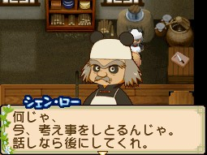

[[此花村]]（このはな村）的醫院、旅人、鍛冶匠等相關角色會在告示板（掲示板）發布委託任務。接取任務後，攜帶指定物品找委託人對話即完成。

## 任務機制

- **接取方式**：到告示板查看並接受委託
- **完成方式**：帶著任務物品，跟委託人對話即可
- **物品隨機**：任務的內容物品都是隨機的
- **任務物品類型**：任務通常都只是採集物、農作物、副產品、魚類、昆蟲、料理、製造機的物品等
- **等級**：D（最低）→ C → B → A → S（最高），難度與報酬均遞增
- **不強求**：普通任務都是反覆出現的，如果任務出現不知道的任務物品不需要勉強接下來
- **探し物（尋物任務）**：特定日期才會出現的限定委託，需在該日期帶指定物品前往
- **限界突破（工具升級任務）**：神·羅特有的鍛造委託，用礦山石＋寶石換取工具升級所需的道具
- **☆ 星等**：表示道具品質等級，☆0.5、☆1.0、☆1.5、☆2.0、☆2.5、☆3.0

本文涵蓋四位委託角色：[[此花村-千尋|千尋]]（醫院助手）、[[此花村-菖蒲|菖蒲]]（醫生）、[[此花村-神·羅|神·羅]]（鍛冶匠，暱稱「熊貓大叔」）、[[此花村-迪魯卡|迪魯卡]]（旅人）。

---

## 千尋（チヒロ）

### RANK D

| 任務名 | 所需物品 | 主要報酬 |
|--------|----------|----------|
| 薬の研究のため（為了藥物研究） | 蕪菁（かぶ）☆0.5以上×1、薄荷（ミント）☆0.5以上×1、魔術藍草（マジックブル－草）☆0.5以上×1、鴻喜菇（しめじ）☆0.5以上×1、香菇（しいたけ）☆0.5以上×1 | 110G、草年糕 |
| 食材をください（請給我食材） | 茄子（なす）☆0.5以上×2、白菜☆0.5以上×2、蕪菁☆0.5以上×1、杏子（あんず）☆0.5以上×2、菠菜（ほうれん草）☆0.5以上×2 | 隨機 |

### RANK C

| 任務名 | 所需物品 | 主要報酬 |
|--------|----------|----------|
| 食材をください | 香菇☆1.0以上×4、鴻喜菇☆1.0以上×4、胡蘿蔔（にんじん）☆0.5以上×2 | 410G、草年糕 |
| 男らしくなりたい（想變得有男子氣概） | 炒蔬菜（野菜いため）☆1.0以上×3、魚板（かまぼこ）☆1.0以上×4 | 隨機 |
| 薬の研究のため | 包心菜（きゃべつ）☆1.0以上×5、延命菊（マーガレット）☆1.0以上×3、香菇☆1.0以上×4、掃帚菇（ホウキタケ）☆0.5以上×3、雪花蓮（スノードロップ）☆0.5以上×2 | 隨機 |
| 先生のため…（為了老師…） | 蘿蔔乾（きりぼし大根）☆1.0以上×4 | 隨機 |

### RANK B

| 任務名 | 所需物品 | 主要報酬 |
|--------|----------|----------|
| 薬の研究のため | 草莓（いちご）☆1.0以上×5、棕色蘑菇（ブラウンマッシュ）☆1.0以上×5、水蘿蔔（ラディッシュ）☆1.0以上×5、紅玫瑰（レッドローズ）☆1.0以上×5、白玫瑰（ホワイトローズ）☆1.0以上×4、胡蘿蔔☆1.0以上×5 | 390G、草年糕、南瓜種子 |
| 食材をください | 極品奶酪（極チーズ）☆1.0以上×5、雞蛋☆1.0以上×5、黑雞蛋☆1.5以上×6、小麥粉☆1.5以上×5 | 隨機 |
| 探し物（秋27日） | 菠菜☆1.0以上×1、小麥粉☆1.0以上×1 | 590G、蜂蜜、茄子種子 |
| 探し物（夏11日） | 失敗作×99 | 100G、蜂蜜、蘿蔔種子 |
| 探し物（春22日） | 黑蛋（黒い卵）☆1.0以上×2 | 300G、蜂蜜、南瓜種子 |

### RANK A

| 任務名 | 所需物品 | 主要報酬 |
|--------|----------|----------|
| 男らしくなりたい | 奶酪包（チーズまん）☆1.5以上×5、至高咖哩（至高のカレー）☆1.5以上×6、豆皮（ゆば）☆1.5以上×5、豆腐☆1.5以上×5、烤魚（焼き魚）☆1.5以上×6、烤蘑菇（焼ききのこ）☆1.5以上×5、高野豆腐（こうや豆腐）☆2.5以上×8、燒賣（しゅうまい）☆2.5以上×8 | 2380G、茶樹種子、南瓜種子 |
| 薬の研究のため | 薄荷☆2.0以上×7、魔術藍草☆2.0以上×7、非洲菊（ガーベラ）☆1.5以上×6、薄荷☆1.5以上×6、龍膽花（りんどう）☆1.5以上×6、雪花蓮☆1.5以上×6 | 隨機 |
| 食材をください | 菠菜☆1.5以上×5、藍莓（ブル－ベリ－）☆1.5以上×5、香菇☆2.0以上×6、蕪菁☆2.0以上×6 | 隨機 |

### RANK S

| 任務名 | 所需物品 | 主要報酬 |
|--------|----------|----------|
| 薬の研究のため | 魔術紅草（マジックレッド草）☆2.0以上×7、大豆☆2.0以上×7 | 2280G、茶樹種子、南瓜種子、蜂王漿 |
| 先生のため… | 納豆☆2.0以上×6、日式沙拉（和風サラダ）☆2.0以上×7、至高咖哩☆2.5以上×7、燉大根（ふろふき大根）☆2.5以上×7、天婦羅（天ぷら）☆3.0以上×9、粥（おかゆ）☆3.0以上×9 | 隨機 |

---

## 菖蒲（アヤメ）

### RANK D

| 任務名 | 所需物品 | 主要報酬 |
|--------|----------|----------|
| 教えてあげる（教你） | 香菇☆0.5以上×1、笹葉（ササ）☆0.5以上×1 | 土豆種子 |
| 薬を作りたいの（想做藥） | 毒菇（どくきのこ）☆0.5以上×1～2、雜草☆0.5以上×1～3 | 130G、蘋果醬 |

### RANK C

| 任務名 | 所需物品 | 主要報酬 |
|--------|----------|----------|
| 薬を作りたいの | 毒菇☆0.5以上×2、雜草☆0.5以上×2 | 430G、蘋果果醬 |
| オトナですもの（畢竟是大人） | 夏茶葉☆1.0以上×4 | 隨機 |
| 夜食をあ願い（拜託宵夜） | 八寶菜☆1.0以上×3 | 隨機 |

### RANK B

| 任務名 | 所需物品 | 主要報酬 |
|--------|----------|----------|
| 薬を作りたいの | 雜草☆1.0以上×5、甘菊（カモミール）☆1.0以上×4、失敗作×4、毒菇☆1.0以上×5、雜草☆2.0以上×6、卡薩布蘭卡（カサブランカ）☆2.0以上×7 | 500G、包心菜種子 |
| 夜食をあ願い | 西瓜泡菜（すいかのつけもの）☆1.0以上×6、魚板☆1.0以上×5 | 隨機 |
| オトナですもの | 香草茶罐（ハーブティー缶）☆1.0以上×4、抹茶罐（まっ茶缶）☆1.0以上×4 | 隨機 |
| 探し物（冬4日） | 巧克力包（チョコレートパック）☆1.0以上×1、冰淇淋（アイスクリーム）☆1.0以上×1 | 900G、可可樹種子、年糕、抹茶罐 |

### RANK A

| 任務名 | 所需物品 | 主要報酬 |
|--------|----------|----------|
| 薬を作りたいの | 雜草☆1.5以上×5～6、月淚草（ムーンドロップ草）☆1.5以上×5、薰衣草（ラベンダ－）☆1.5以上×6、毒菇☆2.0以上×6、失敗作×6 | 2970G、包心菜種子、茄子種子 |
| オトナですもの | 普洱茶罐（プーアル茶缶）☆1.5以上×6、蕎麥茶罐（そば茶缶）☆1.5以上×6 | 隨機 |

### RANK S

| 任務名 | 所需物品 | 主要報酬 |
|--------|----------|----------|
| 薬を作りたいの | 失敗作×6、毒菇☆2.0以上×7、雜草☆2.0以上×6、薰衣草☆2.0以上×6 | 3870G、包心菜種子、茄子種子 |
| オトナですもの | 紅茶罐☆2.5以上×7、黃金綜合紅茶罐（黄金ブレンド紅茶缶）☆2.5以上×8 | 隨機 |
| 夜食をあ願い | 大根辛奇（だいこんのキムチ）☆2.5以上×8、蕪菁醃菜（かぶのつけもの）☆2.5以上×8 | 隨機 |

---

## 神·羅（シェン・ロー）

### RANK D

| 任務名 | 所需物品 | 主要報酬 |
|--------|----------|----------|
| 手伝ってくれぃ！（幫幫我！） | 石材☆0.5以上×1 | 130G、蘋果醬 |

### RANK C

| 任務名 | 所需物品 | 主要報酬 |
|--------|----------|----------|
| 手伝ってくれぃ！ | 石材☆0.5以上×3 | 430G、蘋果醬 |
| 腹がへっては…（肚子餓了…） | 魚板☆1.0以上×3、烤魚☆1.0以上×3 | 隨機 |
| 改造うけたまわる！（承接改造） | 來源僅標註「工具改造相關」，未列出具體所需物品與報酬 | 來源未列出 |

### RANK B

| 任務名 | 所需物品 | 主要報酬 |
|--------|----------|----------|
| 腹がへっては… | 蘿蔔乾☆1.0以上×5、魚板☆1.0以上×4、荷包蛋（目玉焼き）☆1.0以上×4、白菜泡菜（はくさいのつけもの）☆1.0以上×5、日式沙拉☆1.0以上×5、納豆☆1.0以上×5、烤蘑菇☆1.0以上×5、蒸蛋（茶碗むし）☆1.0以上×5 | 335G、蘋果醬、草莓醬 |
| 協力モトム！（尋求協助！） | 草莓大福（いちご大福）☆1.5以上×5、黃豆粉麻糬（あべかわもち）☆1.5以上×6、豆漿布丁（豆乳プリン）☆1.5以上×5、生巧克力（生チョコ）☆1.5以上×6、杏仁豆腐（あんにん豆腐）☆2.0以上×7、南瓜布丁（かぼちゃプリン）☆2.0以上×7 | 隨機 |
| 手伝ってくれぃ！ | 石材☆1.5以上×5、木材☆1.5以上×5 | 隨機 |
| バイトぼしゅう！（打工招募，19:00前完成） | 澆水（畑の水まき）／採收（作物のしゅうかく） | 200～340G、各式農作物副產品 |
| 探し物（冬8日） | 果實酒☆1.0以上×1 | 900G、瑪瑙 |

### RANK A

| 任務名 | 所需物品 | 主要報酬 |
|--------|----------|----------|
| 手伝ってくれぃ！ | 石材☆1.5以上×6、木材☆1.5以上×6 | 2815G、草莓醬、玉米種子 |
| 協力モトム！ | 水果白玉（フルーツ白玉）☆1.5以上×5、栗子饅頭（くりまんじゅう）☆1.5以上×5 | 隨機 |
| 至福（幸福） | 蕪菁醃菜☆2.0以上×6、白辛奇（白キムチ）☆2.0以上×6、蕪菁醃菜☆2.5以上×7、白菜辛奇（はくさいのキムチ）☆2.5以上×7 | 隨機 |
| 腹がへっては… | 蕪菁沙拉（かぶのサラダ）☆2.0以上×6、燉煮馬鈴薯（いもの煮っ転がし）☆2.0以上×7、燉南瓜（かぼちゃの煮つけ）☆1.5以上×5、蟹肉蛋（かに玉）☆1.5以上×6、天婦羅☆2.0以上×7、究極咖哩（究極のカレー）☆2.0以上×6 | 隨機 |
| 限界突破！カマ（鐮刀升級） | 礦山石（鉱山石）×5、月亮石（ムーンストーン）×1 | 抹茶罐、竹子、普洱茶罐 |
| 限界突破！じょうろ（灑水壺升級） | 礦山石×5、紫水晶（アメジスト）×1 | 煎茶罐、竹子、烏龍茶罐 |
| 限界突破！クワ（鋤頭升級） | 礦山石×5、鑽石（ダイヤモンド）×1 | 蕎麥茶罐、竹子、綠茶罐 |

### RANK S

| 任務名 | 所需物品 | 主要報酬 |
|--------|----------|----------|
| 至福 | 四季調酒（グラスワイン四季）☆2.0以上×7、栗子酒調酒（グラスくり酒）☆2.0以上×7 | 3715G、草莓醬、玉米種子 |
| 手伝ってくれぃ！ | 石材☆2.0以上～2.5以上×7、木材☆2.0以上～2.5以上×7 | 隨機 |
| 協力モトム！ | 豆漿布丁☆2.0以上×7、南瓜布丁☆2.0以上×7 | 隨機 |

---

## 迪魯卡（ディルカ）

### RANK D

| 任務名 | 所需物品 | 主要報酬 |
|--------|----------|----------|
| 配達（配送） | 雞蛋☆0.5以上×2、牛奶（ミルク）☆0.5以上×1 | 180G、彩色大地（花束） |
| プレゼント（禮物） | 寬腹蜻蜓（ハラビロトンボ）×3、格蘭特白兜蟲（グラントシロカブト）×2、鈴蟲（クツワムシ）×1、日本羊角蚱（トゲヒシバッタ）×1、短角蝗（ハラヒシバッタ）×3、鬼蜻蜓（オニヤンマ）×2 | 隨機 |

### RANK C

| 任務名 | 所需物品 | 主要報酬 |
|--------|----------|----------|
| プレゼント | 夏赤蜻蛉（シオカラトンボ）×2、寬腹蜻蜓×4、短角蝗（ショウリョウバッタ）×3 | 480G、彩色大地（花束） |
| 配達 | 牛奶☆1.0以上×4 | 隨機 |

### RANK B

| 任務名 | 所需物品 | 主要報酬 |
|--------|----------|----------|
| オレのごはん（我的飯食） | 生魚片（刺身）☆1.5以上×5、豆腐☆1.5以上×6、奶油捲（バターロール）☆1.0以上×4、法式薄餅（ガレット）☆1.0以上×5、燉魚（魚の煮付け）×4、高湯蛋捲（だしまき）×5 | 630G、土豆種子 |
| プレゼント | 蟻塚蟋蟀（アリヅカコオロギ）×4、短角蝗（ショウリョウバッタ）×5、硬幣（コイン）×3、蟋蟀（コオロギ）×3、小翅稻蝗（コバネイナゴ）×5、東方蟈螽（ヒガシキリギリス）×4 | 隨機 |
| 配達 | 雞蛋☆1.0以上×5、牛奶☆1.0以上×4、黃豆粉（きな粉）☆1.0以上×5、上等美乃滋（上マヨネーズ）☆1.0以上×5、極品美乃滋（極マヨネーズ）☆1.0以上×5、白玉粉☆1.0以上×5 | 隨機 |
| 探し物（秋19日） | 秋風之酒（秋風のワイン）☆1.0以上×1 | 360G、上等奶酪、小麥粉、上等黃油 |
| バイトぼしゅう！（打工招募，19:00前完成） | 澆水（畑の水まき）／採收（作物のしゅうかく） | 100～400G、各式蔬菜及種子 |

### RANK A

| 任務名 | 所需物品 | 主要報酬 |
|--------|----------|----------|
| 配達 | 牛奶☆1.5以上×6、雞蛋☆1.5以上×6、香草美乃滋（ハーブマヨネーズ）☆2.5以上×7、上等奶酪（上チーズ）☆2.5以上×8 | 3310G、土豆種子、洋蔥種子 |
| プレゼント | 蟪蛄（アブラゼミ）×6、草蟬（クサゼミ）×5、土蝗（ツチイナゴ）×5、蟋蟀×6 | 隨機 |

### RANK S

| 任務名 | 所需物品 | 主要報酬 |
|--------|----------|----------|
| オレのごはん | 春捲☆2.0以上×7、蕎麥涼麵（ざるそば）☆2.0以上×6 | 4060G、土豆種子、洋蔥種子、胡蘿蔔種子 |
| プレゼント | 負蝗（オンブバッタ）×7、短角蝗（ハラヒシバッタ）×6、鈴蟾（クツワアメガエル）×8、大黃粉蝶（オオキチョウ）×8 | 隨機 |
| 配達 | 極品香草奶酪（極ハーブチーズ）☆3.0以上×8、極品美乃滋☆3.0以上×8 | 隨機 |

---

## 相關

- [[藍鈴村任務系統]] — 藍鈴村動物屋・馬屋組任務攻略
- [[藍鈴村村民任務]] — 藍鈴村村長家組任務攻略
- [[藍鈴村雜貨店木匠神父任務]] — 藍鈴村雜貨店・木匠・神父組任務攻略
- [[此花村村長家種子屋奇利克任務]] — 此花村村長家、種子屋組任務攻略
- [[此花村果樹園食堂雜貨店任務]] — 此花村果樹園・食堂・雜貨店組任務攻略
- [[此花村-千尋]] — 千尋角色條目
- [[此花村-菖蒲]] — 菖蒲角色條目
- [[此花村-神·羅]] — 神·羅角色條目
- [[此花村-迪魯卡]] — 迪魯卡角色條目

## 來源

- [NDS 牧場物語-雙子村 「此花村」醫院、迪魯卡、熊貓大叔的任務](https://leomoon173.pixnet.net/blog/posts/5010971254)，擷取於 2026-07-03
