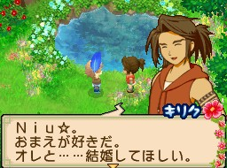

# 結婚與婚後生活

本文整理求婚、結婚流程，以及婚後生子、節慶、親子互動事件的通用規則。各角色的詳細前置條件、劇情內容請見 [[戀愛事件-女主人公]]、[[戀愛事件-男主人公]]。

## 結婚條件

結婚對象需同時滿足以下條件：

- 花朵全開（5 朵花＋大花），愛情度達 65,000 以上。
- 該角色的戀愛事件全部觸發完成（共 4 件）。
- 相關者好友度達 30,000 以上（4 朵花以上）——「相關者」依角色不同，通常是同村的其他村民，詳見個別角色條目。
- 已經增築雙人床（ダブルベッド）。
- 從雜貨店購買[[好感度與愛情度系統|青之羽毛（青い羽根）]]，晴天或雪天將青之羽毛交給結婚對象即可求婚。

> 青之羽毛入手條件：第 2 年後，戀愛對象愛情度達 50,000 以上（5 朵花＋花苞），雜貨店才會出售。

### 逆求婚

女主人公的戀愛對象中，只有[[此花村-奇利克|奇利克（キリク）]]、[[此花村-千尋|千尋（チヒロ）]]、[[藍鈴村-亞修|亞修（アーシュ）]]可以主動向女主人公逆求婚（男生主動求婚），此時女主人公選擇答應即可，不需要先買青之羽毛（若已購買，答應後青之羽毛會自動消失；沒答應則不會消失）。

### 例外角色

[[此花村-迪魯卡|迪魯卡（ディルカ）]]、[[藍鈴村-艾瑞拉|艾瑞拉（アリエラ）]]的追加結婚條件與方法不同於一般角色，詳見 [[戀愛事件-女主人公]]、[[戀愛事件-男主人公]]。

### 婚禮

求婚成功（或逆求婚成功）後一週舉行婚禮；若婚禮當天遇到節日或村民生日，婚禮會延至隔天（兩村節日皆有影響）。結婚後可以重新輸入配偶對主角的稱呼。

## 小孩

### 性別

小孩性別隨機決定。若想指定性別，可在生產事件的前兩天存檔，之後重新讀檔即可重新抽籤。

> 漢化版有翻譯 bug：女主人公版本中，生產後[[此花村-千尋|千尋]]講述孩子性別時一律顯示為男孩，但實際性別可能是女孩；結婚對象講出的小孩姓名顏色也一律顯示紅色（女孩色），不會變成藍色（男孩色）。要判斷真實性別，需從系統設定的姓名本身判斷是男孩用名還是女孩用名。

### 命名

小孩出生後，配偶會先提出命名建議；選擇第 2 個選項可以看到更多遊戲內建的預設名字，一路翻到最後一頁（約 5 頁）選第 1 個選項，則可以自己輸入小孩的名字。

### 小孩喜好

小孩成長(1)後才能開始送禮提升愛情度（出生時已有 5 朵花＋花苞的初始愛情度）。

- 最喜歡：小孩成長(1)階段是[[布丁]]（プリン），小孩成長(2)階段變成[[冰淇淋]]（アイスクリーム）。
- 喜歡：[[藍莓]]（ブルーベリー）、[[梅子]]（うめ）、[[月淚草]]（ムーンドロップ草）、[[杏仁]]（アーモンド）、[[牛奶]]類（ミルク）、[[熱牛奶]]（ホットミルク）、甜點類料理（スイーツ）、[[蜂蜜]]類（ハチミツ類）、果汁類（ジュース）、水果類（フルーツ類）、[[麵包]]（パン）、[[米飯]]（ごはん）、粥（おかゆ）、蓋燒飯（たき込みご飯）、[[烤地瓜]]（焼きいも）、[[蜂蜜吐司]]（ハニートースト）、[[黃油濃湯]]（ヴィシソワーズ）、[[蛋花湯]]（卵スープ）、[[西班牙涼菜湯]]（ガスパチョ）、[[洋蔥湯]]（オニオンスープ）、[[香草湯]]（ハーブスープ）、[[蘆筍湯]]（アスパラのスープ）。

> 料理祭（料理祭り）當天做出的料理，要等大會結束後才能送給小孩，否則小孩不會收。

## 婚後節慶

結婚後，配偶與小孩生日、以及數個婚後專屬節慶都能提升彼此的愛情度。多數節慶的觸發條件是「配偶（有小孩則含小孩）愛情度達 5 朵花以上」，部分節慶要求更高（5 朵花＋大花，即 6 朵全開）；觸發時段則分為「主角起床時，於自宅」或「晚間 20:00～23:59 進入自宅」兩種。

## 婚後事件

以下事件（節日當天不會觸發）能持續增加配偶、小孩的愛情度：

### 配偶生病

**條件**：配偶愛情度 2 朵花以下，且連續 31 天沒有跟配偶對話。
**時間地點**：主角起床時，於自宅；天氣需晴天。

選項：
- `今日は、そばについてる`（今天，就陪著你喲）：愛情度 +3,000
- `わかった、仕事に行く`（明白了，我去工作了）：愛情度 -3,000

### 懷孕

**條件**：已增築高級床滿 31 天、配偶愛情度達 5 朵花＋大花、自宅已增築洗手間與浴室。
**時間地點**：主角起床時，於自宅。

### 生產（小孩出生）

**條件**：懷孕後第 62 天。若當天遇到節日或村民生日，會延至隔天。
**時間地點**：主角起床時，於自宅。

小孩出生後會先躺在床上，無法對話、送禮，直到觸發小孩成長(1)事件。

### 小孩成長(1)

**條件**：小孩出生後第 136 天。
**時間地點**：主角起床時，於自宅。

### 小孩成長(2)

**條件**：小孩出生後第 260 天（即成長(1)後第 124 天）。
**時間地點**：晚間 20:00～23:59，進入自宅。

### 親子洗澡

**條件**：小孩成長(1)後，配偶與小孩愛情度都達 5 朵花以上；限春、夏、秋；天氣需雨天。
**時間地點**：晚間 20:00～23:59，進入自宅。

### 親子賽跑

**條件**：小孩成長(2)後，小孩愛情度達 5 朵花以上。
**時間地點**：18:00～19:59，主角所居住村子（從村裡徒步走出來到出貨箱的那張地圖）；天氣需晴天。

選項：
- `本気で走る`（用實力跑哦）：愛情度 -3,000
- `手加減する`（讓對方）：愛情度 +3,000

### 全家出遊

**條件**：小孩成長(2)後，配偶與小孩愛情度都達 5 朵花以上，且兩人都在自宅內；限春、夏、秋；天氣需晴天。
**時間地點**：早晨 6:00～11:59，進入自宅。

## 劇情特性

- 遊戲沒有情敵事件。
- 戀愛對象不會與其他村民角色結婚。
- 女主人公懷孕期間，工作類活動（農事、畜牧等）不受限制，可正常進行。

## 相關

- 約會與嫉妒對話機制見 [[約會與嫉妒事件]]
- 花朵顏色與愛情度數值對照見 [[好感度與愛情度系統]]
- 各角色詳細前置條件、劇情見 [[戀愛事件-女主人公]]、[[戀愛事件-男主人公]]

## 來源

- [NDS 牧場物語-雙子村 約會、嫉妒、結婚簡介](https://leomoon173.pixnet.net/blog/posts/5012004562)，擷取於 2026-07-05
- [NDS 牧場物語-雙子村 遊戲初期入手疑問Q&A](https://leomoon173.pixnet.net/blog/posts/5012634089)，擷取於 2026-07-05（補充劇情特性）
