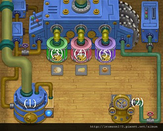

# 製造機小屋（藍鈴村加工設施）

藍鈴村（ブルーベル村）自宅的增築設施之一，內含三種加工機器，可把牧場的原料（牛奶、羊毛、雞蛋、農作物等）加工成售價更高的成品。

## 增築順序

製造機小屋（メーカー小屋）必須依序完成前置增築才能蓋：

`動物放牧地第1次` → `寵物的遊樂場` → `製造機小屋第1次` → `製造機小屋第2次`

## 製造機小屋功能圖解

小屋內共有 5 個標號功能點：

1. 拿取製作完成的物品（未製作藍燈、製作中紅燈、完成後紅藍閃爍）
2. 查看物品製作剩餘時間
3. 毛線製造機（毛糸メーカー）：把羊毛、羊駝毛加工成毛線球
4. 發酵製造機（発酵メーカー）：製作奶酪類、黃油類、酸奶類、蛋黃醬類、納豆、味噌、罐裝巧克力
5. 飲品製造機（ドリンクメーカー）：製作酒類、茶罐類、罐裝類

---

## 發酵製造機（発酵メーカー）產品表

| 名稱 | 日文名 | 材料 | 售價 | 加工時間 |
|------|--------|------|------|---------|
| 奶酪 | チーズ | 牛奶 | 590G | 1h30m |
| 上等奶酪 | 上チーズ | 新澤西牛奶 | 1,170G | 2h |
| 極品奶酪 | 極チーズ | 奇蹟牛奶 | 2,390G | 2h30m |
| 香草奶酪 | ハーブチーズ | 牛奶+甘菊 | 560G | 2h |
| 上等香草奶酪 | 上ハーブチーズ | 新澤西牛奶+甘菊 | 1,090G | 2h30m |
| 極品香草奶酪 | 極ハーブチーズ | 奇蹟牛奶+甘菊 | 2,120G | 3h |
| 酸奶 | ヨーグルト | 牛奶+薄荷 | 560G | 6h |
| 上等酸奶 | 上ヨーグルト | 新澤西牛奶+薄荷 | 1,090G | 8h50m |
| 極品酸奶 | 極ヨーグルト | 奇蹟牛奶+薄荷 | 2,120G | 12h |
| 水果酸奶 | 果実ヨーグルト | 牛奶+薄荷+香蕉+蜜桃 | 2,380G | 7h30m |
| 上等水果酸奶 | 上果実ヨーグルト | 新澤西牛奶+甘菊+薄荷+橘子+蘋果+紫葡萄 | 2,460G | 10h30m |
| 極品水果酸奶 | 極果実ヨーグルト | 奇蹟牛奶+薄荷+紫葡萄+蜜桃+櫻桃 | 2,800G | 13h30m |
| 黃油 | バター | 牛奶+油 | 670G | 1h |
| 上等黃油 | 上バター | 新澤西牛奶+油 | 1,170G | 2h30m |
| 極品黃油 | 極バター | 奇蹟牛奶+油 | 2,380G | 4h |
| 香草黃油 | ハーブバター | 牛奶+甘菊+油 | 750G | 2h |
| 上等香草黃油 | 上ハーブバター | 新澤西牛奶+甘菊+油 | 1,260G | 3h30m |
| 極品香草黃油 | 極ハーブバター | 奇蹟牛奶+甘菊+油 | 2,180G | 5h |
| 蛋黃醬 | マヨネーズ | 雞蛋+油 | 560G | 30m |
| 上等蛋黃醬 | 上マヨネーズ | 黑雞蛋+油 | 720G | 1h |
| 極品蛋黃醬 | 極マヨネーズ | 金雞蛋+油 | 2,940G | 1h30m |
| 香草蛋黃醬 | ハーブマヨネーズ | 雞蛋+甘菊+油 | 580G | 1h |
| 上等香草蛋黃醬 | 上マヨネーズ | 黑雞蛋+甘菊+油 | 810G | 1h15m |
| 極品香草蛋黃醬 | 極マヨネーズ | 金雞蛋+甘菊+油 | 2,940G | 1h45m |
| 罐裝巧克力 | チョコレートパック | 可可豆 | 2,460G | 2h15m |
| 味噌 | みそ | 大豆+米飯 | 840G | 60h |
| 納豆 | 納豆 | 大豆+稻穗 | 1,150G | 2h15m |

## 毛線製造機（毛糸メーカー）產品表

| 名稱 | 日文名 | 材料 | 售價 | 加工時間 |
|------|--------|------|------|---------|
| 毛線球 | 毛糸玉 | 羊毛 | 1,820G | 11h30m |
| 薩福克羊毛線球 | サフォーク毛糸玉 | 好羊毛 | 2,840G | 12h30m |
| 極品毛線球 | 極毛糸玉 | 軟羊毛 | 7,280G | 15h |
| 白色羊駝毛線球 | 白アルパカ毛糸玉 | 白色羊駝的毛 | 11,200G | 15h |
| 茶色羊駝毛線球 | 茶アルパカ毛糸玉 | 茶色羊駝的毛 | 11,200G | 22h30m |

## 飲品製造機（ドリンクメーカー）產品表

| 名稱 | 日文名 | 材料 | 售價 | 加工時間 |
|------|--------|------|------|---------|
| 葡萄酒 | ワイン | 紫葡萄 | 1,050G | 24h |
| 玉米酒 | チチャ | 玉米+酸奶 | 1,400G | 24h |
| 蜂蜜酒 | ハチミツ酒 | 蜂蜜+葡萄酒 | 1,780G | 24h |
| 栗子酒 | くり酒 | 栗子+葡萄酒 | 1,260G | 24h |
| 梅子酒 | うめ酒 | 梅子+葡萄酒 | 1,190G | 24h |
| 杏仁酒 | あんず酒 | 杏仁+葡萄酒 | 1,190G | 24h |
| 果酒 | 果実酒 | 葡萄酒+蘋果+蜜桃 | 2,570G | 24h |
| 玫瑰葡萄酒 | ローズワイン | 葡萄酒+粉紅玫瑰+紅玫瑰+白玫瑰+藍色冰姬 | 12,430G | 36h |
| 春風葡萄酒 | 春風のワイン | 葡萄酒+草莓 | 2,070G | 24h |
| 夏風葡萄酒 | 夏風のワイン | 葡萄酒+蕃茄 | 1,260G | 24h |
| 秋風葡萄酒 | 秋風のワイン | 葡萄酒+蘋果 | 1,560G | 24h |
| 四季葡萄酒 | 四季のワイン | 葡萄酒+春風葡萄酒+夏風葡萄酒+秋風葡萄酒 | 4,200G | 72h |
| 啤酒 | ビール | 小麥+大豆 | 1,090G | 24h |
| 綠茶罐 | 綠茶罐 | 春茶葉 | 310G | 2h30m |
| 抹茶罐 | まっ茶缶 | 綠茶罐 | 340G | 2h30m |
| 煎茶罐 | せん茶缶 | 春茶葉+夏茶葉 | 190G | 2h30m |
| 普洱茶罐 | プーアル茶缶 | 夏茶葉 | 370G | 2h30m |
| 烏龍茶罐 | ウーロン茶缶 | 夏茶葉+秋茶葉 | 610G | 2h30m |
| 蕎麥茶罐 | そば茶缶 | 夏茶葉+蕎麥 | 900G | 2h30m |
| 胡蘿蔔茶罐 | 人參茶罐 | 夏茶葉+秋茶葉+胡蘿蔔 | 1,420G | 5h |
| 紅茶罐 | 紅茶罐 | 秋茶葉 | 310G | 2h30m |
| 香草茶罐 | ハーブティー缶 | 薄荷+甘菊+薰衣草 | 250G | 7h30m |
| 玫瑰茶罐 | ローズティー缶 | 秋茶葉+粉紅玫瑰 | 2,040G | 60h30m |
| 春色罐裝紅茶 | 春色ブレンド紅茶缶 | 紅茶罐+草莓 | 1,620G | 30h |
| 夏色罐裝紅茶 | 夏色ブレンド紅茶缶 | 紅茶罐+西瓜 | 8,400G | 30h |
| 秋色罐裝紅茶 | 秋色ブレンド紅茶缶 | 紅茶罐+蘋果 | 1,090G | 30h |
| 黄金罐裝紅茶 | 黄金ブレンド紅茶缶 | 紅茶罐+橘子+香蕉+櫻桃 | 3,080G | 84h |
| 咖啡粉 | コーヒーパック | 咖啡豆 | 630G | 6h15m |
| 罐裝可可茶 | ココアパック | 罐裝巧克力 | 2,660G | 6h30m |

---

## 相關

- [[背包與馬車系統]] — 加工品的收納與搬運
- [[藍鈴村雜貨店木匠神父任務]] — 增築設施的委託流程

## 來源

- [NDS 牧場物語-雙子村 藍鈴村的製造機小屋](https://leomoon173.pixnet.net/blog/posts/5011652176)，擷取於 2026-07-05
