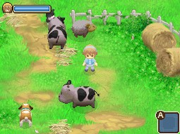
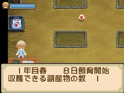
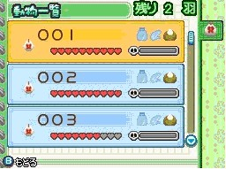
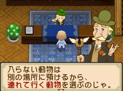
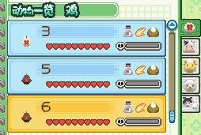
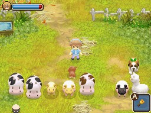

# 動物飼養管理攻略

《牧場物語 雙子村》（ふたごの村）除了雞（ニワトリ）、牛（ウシ）、羊（ヒツジ）之外，還新增了[[羊駝]]（アルパカ）。本文整理動物飼養的完整機制：飼養數量上限、搬家時的動物處理、購買賣出與妊娠、日常照顧、放牧、飼料餵食、點心加成、動物壽命與死亡機率，以及加工副產品對照。各動物種類的成長天數、副產品與賣價表整理在文末〈動物總覽〉。

小技巧：往牛、羊、羊駝身上跳躍後牠們會往前行走；連續讓牠們跳躍不落地會有特別音效（5 次口哨聲、10 次 GOOD 聲音、30 次升級聲音）。

## 飼養數量

- **[[此花村]]（このはな村）**：放牧地無法增築，只能飼養雞 2 隻、牛+羊+羊駝共 4 頭。
- **[[藍鈴村]]（ブルーベル村）**：
  - 雞小屋放牧地無法增築，雞最多飼養 10 隻。
  - 完成增築擴寬放牧地（`放牧地を広げます～`）可增加動物（牛、羊、羊駝）飼養數量：
    - 未增築前：最多飼養 6 頭。
    - 第 1 次增築：最多飼養 11 頭。
    - 第 2 次增築：最多飼養 16 頭。

## 搬家（引越）時的動物

搬家日期：每個月 23 日～30 日，村長家（役場）營業時間內。

- 搬家費用：3,000 G（在村長家辦理）。
- **從此花村搬去藍鈴村**：不用特意選擇動物，因為藍鈴村的飼養數量比此花村多，動物會全部搬過去。
- **從藍鈴村搬去此花村**：此花村只能飼養雞 2 隻、牛+羊+羊駝共 4 頭，藍鈴村村長會讓主角選擇牛+羊+羊駝 4 頭、雞 2 隻搬過去；其餘動物暫時寄放在藍鈴村，主角搬回藍鈴村後歸還。暫時寄放、尚未長大的動物會停止成長，直到歸還為止。
- 如果有動物正在妊娠中，主角無法搬家，只能等動物出生後才能搬家。
- 操作：選擇動物按 A 鍵，取消按 B 鍵，確定按 START 鍵。

## 動物購買、賣出、妊娠（懷孕）

藍鈴村的動物屋（ジェシュ・アニマルリー）可以購買動物、賣出動物、辦理動物妊娠、購買動物飼料。購買動物、賣出、妊娠的時間與價錢請參考 [[藍鈴村]]（本文來源未提供這些數值，待該篇補齊後另建動物條目）。

關於妊娠（懷孕）：

- 小雞、小羊、小牛不能妊娠，沒[[羊毛]]的大羊可以妊娠。
- 妊娠出生的動物愛心數，是妊娠動物愛心數的一半（例如愛心數 10 顆的牛，妊娠生產出來的小牛有 5 顆心）。
- 無法同時 2 隻以上動物妊娠，一次只能妊娠 1 種動物。
- 妊娠的動物會暫時寄放在動物屋，生產後才會出現。

## 照顧動物

動物的資產表在動物小屋內左邊桌子，上面顯示愛心數（好感度）、餵食、觸摸、副產品、壓力值圖案；有做到的動作圖案才會顯示（灰色表示沒有）。

- 飼料圖案：餵食動物。
- 手圖案：觸摸（抱起雞，跟牛、羊、羊駝對話或用刷子刷洗、使用牛鈴、用聽診器）。
- [[雞蛋]]、擠奶器、剪刀圖案：收穫動物的副產品。
- 骷髏灰色橫條：動物的壓力值（壓力值蓄滿動物會生病，生病不理會後會死亡）。

**增加愛心數（好感度）：**

- 雞：放牧、餵食、抱雞、餵點心。
- 牛、羊、羊駝：放牧、餵食、對話（或用聽診器）、使用牛鈴、用刷子刷洗、取得副產品、餵點心。

**壓力值增加的原因**（動物生病可以到動物屋購買動物的藥）：

- 使用工具攻擊動物。
- 沒餵食飼料（放牧不用餵食）。
- 雨天、颱風、暴風雪等天氣放牧。
- 21:00 後動物在睡覺，觸碰到動物會生氣。
- 連續幾天沒有用刷子刷毛（牛、羊、羊駝），動物變得太髒而置之不理。

## 放牧相關

- 放牧的動物不用餵飼料。
- 放牧時間為 17:00～21:00，動物睡覺前須推回小屋。
- 在放牧地使用牛鈴可以讓動物排排站（在動物小屋內使用可以讓動物靠近主角身邊）。
- 晴天、雪天可以放牧；雨天、颱風、暴風雪不可以放牧，勉強放牧會增加壓力值。
- 雞若放牧在外過夜，無法拿到副產品（雞蛋）。

## 小屋內飼料餵食

- 倉庫飼料不要超過 99 個，超過會有物品消失的 BUG。
- 飼料在藍鈴村動物屋（ジェシュ・アニマルリー）櫃檯購買，放在馬車（倉庫）後就可以在動物小屋直接拿取。
- 飼料 1 份等於 5 隻/頭動物的份量，1 個飼料槽最多可放置 2 份飼料。
- 在動物小屋內扔飼料的位置必須從左上方那格開始，順序為：左上、右上、左下、右下。
- **雞小屋**：把飼料扔在地上石板上即可。上方兩格各餵 3 隻雞、下方兩格各餵 2 隻雞，共 10 隻雞。
- **動物小屋**：把飼料扔進飼料槽。1 格飼料槽供 4 頭動物，共 16 頭；一格滿了飼料須投至另一格。

## 動物點心（茶點）

適用於雞、牛、羊、羊駝。點心在藍鈴村動物屋（ジェシュ・アニマルリー）櫃檯購買，種類有 4 種：茶點、野菜茶點、穀物茶點、魚味茶點（購買價格請參考 [[藍鈴村]]）。

- 每天只能給 1 次點心，把點心拿在手上跟動物對話即可。
- 給予一定數量的點心可以增加動物副產品的收穫數量，不需要依照給予順序，只要滿足給予次數即可（未長大的動物也有效）。
- 收穫數量從 1 個增加到 2 個、3 個⋯每次增加所需的點心次數都相同（最多 5 個收穫數量）。
- 收穫副產品數量可在動物小屋資產表上屏幕的「収穫できる副産物の数」查看。
- 累計數：只算有沒有給過，不會重新計算。3 個以上副產品的累計數公式：**給予的茶點數 × (副產品數量 - 1)**。例如雞要增加到 5 個副產品，`2 × (5 - 1) = 8`，需要 8 個茶點（先給完 8 個後就不用再給）。

**增加副產品必要的茶點數量（累計數）**

| 動物 | 目標副產品數 | 茶點 | 野菜 | 穀物 | 魚味 | 合計 |
|---|---|---|---|---|---|---|
| 雞 | 2 | 2 個 | 15 個 | 4 個 | 10 個 | 31 個 |
| [[黑雞]]（黒ニワトリ） | 2 | 1 個 | 14 個 | 2 個 | 14 個 | 31 個 |
| 牛 | 2 | 7 個 | 8 個 | 15 個 | 1 個 | 31 個 |
| [[茶牛]]（大茶ウシ） | 2 | 4 個 | 6 個 | 20 個 | 1 個 | 31 個 |
| 羊 | 2 | 2 個 | 12 個 | 12 個 | 5 個 | 31 個 |
| [[黑羊]]（大黒ヒツジ） | 2 | 1 個 | 15 個 | 9 個 | 6 個 | 31 個 |

**羊駝（アルパカ）增加副產品必要的茶點數量（累計數）**（無茶點選項）

| 目標副產品數 | 茶點 | 野菜 | 穀物 | 魚味 | 合計 |
|---|---|---|---|---|---|
| 2 | - | 15 個 | 15 個 | 15 個 | 45 個 |
| 3 | - | 30 個 | 20 個 | 20 個 | 70 個 |
| 4 | - | 45 個 | 25 個 | 25 個 | 95 個 |
| 5 | - | 60 個 | 30 個 | 30 個 | 120 個 |

## 動物壽命

（資料參考由巴哈姆特牧場物語哈拉版）動物在某一定遊戲年數會隨機機率死亡，隨著歲月越久死亡機率越高，大約都在 3～4 年之久。動物死亡時，動物屋老闆娘會到主角自宅訪問，這時可以得到評語，會根據動物的愛情度、比賽的優勝經驗、死因等變化。

**生存天數死亡機率表**

| 生存天數 | 雞 | 黑雞 | 牛 | 新澤西牛 | 羊 | 黑羊 | 羊駝 |
|---|---|---|---|---|---|---|---|
| 0 年（0～123 天） | 0% | 0% | 0% | 0% | 0% | 0% | 0% |
| 1 年（124～247 天） | 0% | 5% | 0% | 5% | 0% | 5% | 5% |
| 2 年（248～371 天） | 5% | 10% | 5% | 10% | 5% | 10% | 10% |
| 3 年（372～495 天） | 10% | 40% | 10% | 30% | 10% | 30% | 30% |
| 4 年（496～619 天） | 40% | 70% | 30% | 50% | 30% | 50% | 50% |
| 5 年（620～743 天） | 70% | 100% | 50% | 80% | 50% | 80% | 80% |
| 6 年（744～867 天） | 100% | 100% | 80% | 100% | 80% | 100% | 100% |
| 7 年後（868 天後） | 100% | 100% | 100% | 100% | 100% | 100% | 100% |

## 使用藍鈴村製造機的加工副產品

| 副產品 | 加工後的副產品 |
|---|---|
| 雞蛋 | [[蛋黃醬]]類 |
| [[牛奶]] | [[奶酪]]類、[[酸奶]]類 |
| 羊毛 | 毛線團 |
| [[黑雞蛋]] | [[上等蛋黃醬]]類 |
| [[新澤西牛奶]] | [[上等奶酪]]類、[[上等酸奶]]類 |
| [[好羊毛]] | 薩福克羊毛線團 |
| [[金雞蛋]] | [[極品蛋黃醬]]類 |
| [[軟羊毛]] | 極品毛線團 |
| [[奇蹟牛奶]] | [[極品奶酪]]類、[[極品酸奶]]類 |
| [[白色羊駝的毛]] | 白色羊駝毛線團 |
| [[茶色羊駝的毛]] | 茶色羊駝毛線團 |

## 動物總覽

新品種動物（烏骨雞、薩福克羊、新澤西牛）第 2 年才會開始隨機出售；羊駝在第 2 年秋季才會開始隨機出售。一般羊則需先飼養過牛、雞之後，藍鈴村動物屋才會開始隨機出售。金雞蛋、奇蹟牛奶、軟羊毛這幾種副產品，在[[動物祭]]裡優勝的新品種動物取得機率比較高。動物生病時無法取得副產品。

### 雞（ニワトリ）

成長：小雞 8～10 天成長為雞。壽命：雞大約 2 年～3 年 1 個月，烏骨雞（黑雞）大約 3 年 2 個月。在動物祭的雞祭贏得優勝的雞有機率生產金雞蛋。

| 名稱（日文） | 副產品 | 收穫天數 |
|---|---|---|
| 雞（ニワトリ） | 雞蛋（卵） | 每天 |
| 烏骨雞／黑雞（黒ニワトリ） | 烏骨雞蛋／黑雞蛋（黒い卵） | 每天 |
| 冠軍雞（優勝したニワトリ） | 金雞蛋（金い卵，原文如此） | 隨機 |

**副產品賣價（依星級 ☆1.0–5.0，單位 G）**

| 副產品 | ☆1.0 | ☆1.5 | ☆2.0 | ☆2.5 | ☆3.0 | ☆3.5 | ☆4.0 | ☆4.5 | ☆5.0 |
|---|---|---|---|---|---|---|---|---|---|
| 雞蛋 | 140 | 160 | 190 | 210 | 240 | 260 | 280 | 310 | 330 |
| 黑雞蛋 | 240 | 280 | 320 | 360 | 400 | 440 | 480 | 520 | 560 |
| 金雞蛋 | - | - | - | 1,800 | 2,000 | 2,200 | 2,400 | 2,600 | 2,800 |

### 牛（ウシ）

成長：小牛 20 天成長為大牛。壽命：牛大約 3 年 2 個月～4 年，新澤西牛（茶色牛）大約 3 年 2 個月～4 年。在動物祭的牛祭贏得優勝的牛有機率生產奇蹟牛奶。

| 名稱（日文） | 副產品 | 收穫天數 |
|---|---|---|
| 牛（ウシ） | 牛奶（ミルク） | 每天 |
| 新澤西牛／茶色牛（大茶ウシ） | 新澤西牛奶（ジャージーミルク） | 每天 |
| 冠軍牛（優勝したヒツジ，原文如此） | 奇蹟牛奶（ミラクルミルク） | 隨機 |

**副產品賣價（依星級 ☆1.0–5.0，單位 G）**

| 副產品 | ☆1.0 | ☆1.5 | ☆2.0 | ☆2.5 | ☆3.0 | ☆3.5 | ☆4.0 | ☆4.5 | ☆5.0 |
|---|---|---|---|---|---|---|---|---|---|
| 牛奶 | 240 | 280 | 320 | 360 | 400 | 440 | 480 | 520 | 560 |
| 新澤西牛奶 | 480 | 560 | 640 | 720 | 800 | 880 | 960 | 1,040 | 1,120 |
| 奇蹟牛奶 | - | - | - | - | 1,600 | 1,760 | 1,920 | 2,080 | 2,240 |

### 羊（ヒツジ）

成長：小羊 20～21 天成長為羊。壽命：羊大約 3 年 2 個月，薩福克羊（黑羊）大約 3 年 2 個月。在動物祭的羊祭贏得優勝的羊有機率生產軟羊毛。

| 名稱（日文） | 副產品 | 收穫天數 |
|---|---|---|
| 羊（ヒツジ） | 羊毛 | 每 3 天 |
| 薩福克羊／黑羊（大黒ヒツジ） | 好羊毛（いい羊毛） | 每 3 天 |
| 冠軍羊（優勝したヒツジ） | 軟羊毛（ふわわ羊毛） | 隨機 |

**副產品賣價（依星級 ☆1.0–5.0，單位 G）**

| 副產品 | ☆1.0 | ☆1.5 | ☆2.0 | ☆2.5 | ☆3.0 | ☆3.5 | ☆4.0 | ☆4.5 | ☆5.0 |
|---|---|---|---|---|---|---|---|---|---|
| 羊毛 | 600 | 700 | 800 | 900 | 1,000 | 1,100 | 1,200 | 1,300 | 1,400 |
| 好羊毛 | 960 | 1,120 | 1,280 | 1,440 | 1,600 | 1,760 | 1,920 | 2,080 | 2,240 |
| 軟羊毛 | - | - | - | - | - | - | - | - | 5,600 |

### 羊駝（アルパカ）

羊駝剛買的時候會因為陌生而跑走，飼養 2、3 天就不會了。羊駝能感應主角，主角在哪個方向羊駝就會轉往哪個方向；有時會一直高興地跳躍，跳躍時無法使用道具，可以推一下讓牠停止跳躍。壽命大約 3 年。

| 名稱（日文） | 副產品 | 收穫天數 |
|---|---|---|
| 白色羊駝（白アルパカ） | 白色羊駝的毛（白いアルパカの毛） | 每 5 天 |
| 茶色羊駝（茶アルパカ） | 茶色羊駝的毛（茶色いアルパカの毛） | 每 5 天 |

**副產品賣價（依星級 ☆1.0–5.0，單位 G）**

| 副產品 | ☆1.0 | ☆1.5 | ☆2.0 | ☆2.5 | ☆3.0 | ☆3.5 | ☆4.0 | ☆4.5 | ☆5.0 |
|---|---|---|---|---|---|---|---|---|---|
| 羊駝的毛 | 3,600 | 4,200 | 4,800 | 5,400 | 6,000 | 6,600 | 7,200 | 7,800 | 8,400 |

## 補充圖片

搬家流程與資產表示意圖：

## 相關

- [[藍鈴村]]
- [[此花村]]
- [[好感度數值與茶點時間表]]

## 來源

- [NDS 牧場物語-雙子村 動物飼養簡介](https://leomoon173.pixnet.net/blog/posts/5011712126)，擷取於 2026-07-05
- [NDS 牧場物語-雙子村 遊戲初期入手疑問Q&A](https://leomoon173.pixnet.net/blog/posts/5012634089)，擷取於 2026-07-05（補充搬家費用、羊出售解鎖條件）
