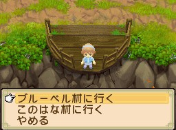
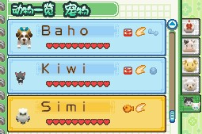
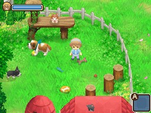

# 寵物飼養攻略

《牧場物語 雙子村》（ふたごの村）的寵物除了狗（小型犬）、貓之外，還有大型犬、貓頭鷹、馬。本文整理寵物的購買、餵食、放牧幫手、好感度、訓練與遊樂場機制；各寵物的詳細數值見 [[大型犬]]、[[小型犬]]、[[貓]]、[[貓頭鷹]]、[[馬]]。

連續在貓頭鷹身上跳躍不落地會有特別的音效（5 次口哨聲、10 次 GOOD 聲音、30 次升級聲音）。

## 寵物購買

寵物在兩村的馬屋購買：藍鈴村的薛‧古拉尼（シェ・グラニー），此花村的青梅竹馬（竹馬の友）。詳細價格與出售條件見 [[藍鈴村商店指南]]。

- 最多同時擁有 6 隻狗、貓，加上馬和貓頭鷹，共 8 隻寵物。
- 貓頭鷹、馬只能各購買 1 隻。
- 同種類的狗、貓只能各購買 2 隻：大型犬 2 隻、小型犬 2 隻、貓 2 隻（顏色沒有限制）。
- 馬、狗、貓的顏色都是隨機的，第 2 年會有新的顏色。
- 貓、狗、貓頭鷹**不能賣掉**（如果想要新顏色，飼養數量要注意）。
- 馬可以更換顏色，也可以更換品種：購買新的馬後可以重新命名，原先的馬會換成新購買的馬。
- 狗、貓需先飼養過雞、牛、羊之後才會開始出售；貓頭鷹第 1 年夏季登場，需完成第 1 次隧道挖掘任務。

## 寵物餵食

寵物不會生病、不會死亡，餵食會增加好感度（愛心數）。寵物的食物在兩村的雜貨店購買，有寵物後雜貨店會隨機出售對應飼料：馬吃馬用曲奇（150 G）、狗貓吃寵物飼料（150 G）、貓頭鷹吃貓頭鷹飼料（150 G）。

- 狗、貓的飼料投入自宅門口右邊的飼料箱，會自動去吃。
- 貓頭鷹、馬的食物只要扔在牠們附近的地上會自動過去吃（馬有裝備馬車時不會吃）。
- **狗、貓沒有餵食會減少好感度**；馬、貓頭鷹沒有餵食不會減少好感度。

## 寵物幫手

- **貓**：幫忙放牧雞。
- **大型犬**：幫忙放牧牛。
- **小型犬**：幫忙放牧羊、羊駝。
- 狗、貓 7:00 會自動幫忙放牧，17:00 把動物帶回動物小屋。
- **馬**：拉馬車（倉庫），品種不同能拉動不同重量的馬車，詳見 [[馬]]、[[背包與馬車系統]]。
- **貓頭鷹**：9:00 自動飛出自宅、18:00 飛回自宅；在山頂可以呼喚貓頭鷹，牠會幫主角帶到要去的村子附近（雨天、颱風、暴風雪無法呼喚，但呼喚本身沒有時間、次數限制）。

## 寵物好感度

資產表在動物小屋內的左邊桌子。狗、貓好感度大約 7～8 顆心以上時，會感應到附近的主角並喜歡跟在旁邊；貓頭鷹則會喜歡停在主角頭上。

- **狗**：每天抱、餵食、使用聽診器、用膠骨（骨ガム）訓練（無限次）。
- **貓**：每天抱、餵食、使用聽診器、用貓鈴（すず）訓練（無限次）。
- **貓頭鷹**：餵食、每天抱；每在山頂呼喚一次，就可以再次餵食和觸摸。
- **馬**：沒有好感度系統，照顧與否純看個人意願（每天第一次騎乘、餵食、刷毛、使用聽診器，頭上會出現愛心符號）。

膠骨、貓鈴訓練狗、貓時，好感度增加速度比其他方式快（有狗貓後，雜貨店會隨機出售膠骨、貓鈴，可重複購買；放在地上沒收好隔天會消失）。

### 狗、貓的訓練方法

把膠骨、貓鈴扔出去讓狗、貓撿回來，撿回後頭上出現愛心符號才算完成 1 次訓練。對著牆以一定距離扔，可縮短撿取時間，效率較高。

### 放牧數量對應好感度表

剛買的寵物不會放牧，需要累積一定好感度才會開始放牧；每隻寵物最多放牧 5 隻動物。

**大型犬**

| 愛心數 | 1顆心 | 2~3顆心 | 4~5顆心 | 6~8顆心 | 9~10顆心 |
|---|---|---|---|---|---|
| 好感度數值 | 0~199 | 200~399 | 400~599 | 600~899 | 900~1000 |
| 放牧數量 | 1 | 2 | 3 | 4 | 5 |

0 顆心好感度時，好感度數值 30～99 也會放牧 1 隻。

**小型犬、貓**

| 愛心數 | 1顆心 | 2~3顆心 | 4~5顆心 | 6~7顆心 | 8~10顆心 |
|---|---|---|---|---|---|
| 好感度數值 | 0~199 | 200~399 | 400~599 | 600~799 | 800~1000 |
| 放牧數量 | 1 | 2 | 3 | 4 | 5 |

0 顆心好感度時，小型犬好感度數值 60～99、貓好感度數值 30～99 也會放牧 1 隻。

## 寵物遊樂場

寵物遊玩地是自宅可增築的設施（`ペットの遊び場を作るわ～`），除了讓寵物玩耍似乎沒有其他特別作用。

- 可以把寵物扔進去讓寵物遊玩，裡面使用膠骨、貓鈴無效。
- 放牧的時間到了，寵物還是會照常去幫忙放牧。
- 實用技巧：白天訓練狗、貓好感度時，先把好感度已滿的寵物扔進遊樂場，再專心訓練還需要提升好感度的狗、貓。

## 相關

- [[大型犬]]、[[小型犬]]、[[貓]]、[[貓頭鷹]]、[[馬]]
- [[藍鈴村商店指南]]
- [[動物飼養管理攻略]]
- [[背包與馬車系統]]
- [[好感度數值與茶點時間表]]

## 來源

- [NDS 牧場物語-雙子村 寵物、蜂箱、池塘(魚池)簡介](https://leomoon173.pixnet.net/blog/posts/5038408668)，擷取於 2026-07-05
- [NDS 牧場物語-雙子村 遊戲初期入手疑問Q&A](https://leomoon173.pixnet.net/blog/posts/5012634089)，擷取於 2026-07-05（補充寵物購買解鎖條件）
