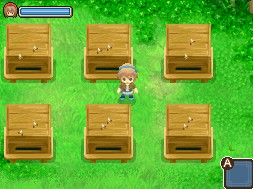

# 蜂箱與蜂蜜

蜂箱（養蜂）是藍鈴村（ブルーベル村）限定的自宅增築設施。把物品拿在手上，站在蜂箱前顯示 A 圖案的位置，按 A 鍵可以投入物品（蜂窩、香水）或收穫蜂蜜。

> **未解問題**：蜂箱設施本身的增築取得條件與費用，來源指向另一篇尚未收錄的「增築簡介」文章，待之後收錄該篇再補。

## 投入蜂窩

蜂箱必須先投入蜂窩（蜂の巣）才能開始運作，蜂窩可以在山道獲得（詳見 [[山道系統]]，售價 100G、1.5☆）。每個蜂箱只要投入一個蜂窩，就不必再投入。

- 蜂蜜能收穫的季節只有春、夏、秋；隔年春天時，必須再投入新的蜂窩。
- 蜂蜜收穫天數為 7～8 天，可收穫時蜂箱會出現金色亮光。

## 提升品質

投入的蜂窩幾顆星度品質，收穫的蜂蜜就是幾顆星度品質。

在蜂箱投入香水可以再提升蜂蜜的星度品質：投入的香水星度品質越高，蜂蜜提升的星度品質就越明顯。香水**每天只能投入 1 次**，投入後蜂箱會出現藍色亮光；要持續提升蜂蜜品質，必須每天投入香水。香水配方見 [[藍鈴村商店指南]]。

## 蜂蜜種類

如果在田地裡種植作物，蜂蜜的種類會有變化（蜂蜜種類不能共存，除了季節性蜂蜜）：

- **蜂蜜**：不種植任何作物時收穫。
- **春／夏／秋之蜂蜜**：有種植作物時，依季節收穫對應種類。
- **野樹之蜂蜜**：種植果樹後有 30% 機率出現（只有增築的田地 20 格裡才能種植果樹）。
- **薔薇之蜂蜜**：藍鈴村能種植的（全部）田地位置種滿玫瑰系花朵並且不收穫，有 10% 機率出現。
- **蜂王漿**：無法透過蜂箱種植取得，而是從 [[此花村-千尋|千尋]]、[[賢者大人-優萊卡|賢者大人]] 的任務謝禮入手（見 [[米海爾女神大人艾瑞拉賢者任務]]）。

| 日文名稱 | 中文譯名 | 星度 | 賣價 G |
|---|---|---|---|
| ハチミツ | 蜂蜜 | 5.0☆ | 720 |
| 春のハチミツ | 春之蜂蜜 | 5.0☆ | 840 |
| 夏のハチミツ | 夏之蜂蜜 | 5.0☆ | 840 |
| 秋のハチミツ | 秋之蜂蜜 | 5.0☆ | 800 |
| バラのハチミツ | 薔薇之蜂蜜 | 5.0☆ | 1,120 |
| 樹木のハチミツ | 野樹之蜂蜜 | 5.0☆ | 890 |
| ローヤルゼリー | 蜂王漿 | 5.0☆ | 2,800 |

## 相關

- [[山道系統]] — 蜂窩取得地點
- [[藍鈴村商店指南]] — 香水配方
- [[米海爾女神大人艾瑞拉賢者任務]] — 蜂王漿任務謝禮來源
- [[動物飼養管理攻略]]

## 來源

- [NDS 牧場物語-雙子村 寵物、蜂箱、池塘(魚池)簡介](https://leomoon173.pixnet.net/blog/posts/5038408668)，擷取於 2026-07-05
