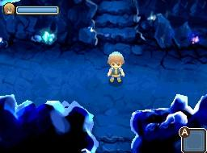
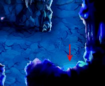
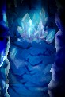
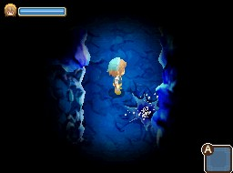
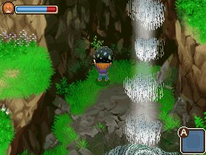

# 雙子村礦山攻略

雙子村的礦山（鉱山）位於隧道（トンネル）裡，**必須完成第 5 次的隧道挖掘任務才會解鎖**。原文未明確標示礦山歸屬此花村（このはな村）還是藍鈴村（ブルーベル村），推測為雙村共通設施。

## 礦山採集點

礦山內共有 **4 個採集點**：

- 中間
- 左上
- 右上
- 左下

礦山內另有噴水陷阱，需留意避開。

## 敲礦技巧

敲擊礦山石（鉱山石）時，**「1 次敲 1 個」才能獲得礦石與寶石**；1 次敲擊 2 個以上，只會出現廢礦石（クズ鉱石）。

## 礦山石隱藏星度品質

每一份礦石／寶石都帶有隱藏的「星度」品質，範圍 **☆0.5 ~ ☆5.0**，星度越高賣價越高（詳細對照表見〈礦石、寶石一覽〉）。

## 入手管道

- **任務獲得**：如春 18 日透過神‧羅的相關任務、冬 2 日透過穆喬的相關任務，可取得特定礦石／寶石
- **各地採集點**：例如瀑布後面的岩石裂縫採集點，有機率取得廢礦石、礦山石、銅、銀
- **季節性獲得**：部分礦石依季節出現
- **競賽獲得**：料理大會、作物祭等競賽亦可能取得
- **雨天、雪天**：礦山裡的謎之石版等特定礦物在雨天、雪天才有機率採集到

## 必須用到礦山石、礦石、寶石的地方

- **增築需求**：房屋、畜舍等增築工程會用到特定礦石
- **工具升級需求**：鎬子等工具升級需要對應礦石
- **煉金術需求**：金剛石、紅寶石、謎之石版、螢石等是煉金術材料
- **馬車任務需求**：謎之石版等亦用於馬車任務交付

## 礦石、寶石一覽（依星度賣價）

| 礦物 | ☆0.5 | ☆1.0 | ☆2.0 | ☆3.0 | ☆4.0 | ☆5.0 |
|---|---|---|---|---|---|---|
| 謎之石版（謎の石版） | 500 | 600 | 800 | 1,000 | 1,200 | 1,400 |
| 銅 | 500 | 600 | 800 | 1,000 | 1,200 | 1,400 |
| 銀 | 4,500 | 5,400 | 7,200 | 9,000 | 10,800 | 12,600 |
| 金 | 5,000 | 6,000 | 8,000 | 10,000 | 12,000 | 14,000 |
| 金剛石（アダマンタイト）／奧利哈鋼（オリハルコン）／秘銀（ミスリル） | 3,200 | 3,840 | 5,120 | 6,400 | 7,680 | 8,960 |
| 螢石（ほたる石）等 8 種寶石 | 3,700 | 4,440 | 5,920 | 7,400 | 8,880 | 10,360 |
| 翡翠（ひすい） | 4,000 | 4,800 | 6,400 | 8,000 | 9,600 | 11,200 |
| 鑽石（ダイヤモンド） | 5,000 | 6,000 | 8,000 | 10,000 | 12,000 | 14,000 |
| 月亮石（ムーンストーン） | 4,500 | 5,400 | 7,200 | 9,000 | 10,800 | 12,600 |
| 粉紅鑽石（ピンクダイヤモンド） | 15,000 | 18,000 | 24,000 | 30,000 | 36,000 | 42,000 |

「螢石等 8 種寶石」完整名單：[[螢石]]、[[縞瑪瑙]]、[[紫水晶]]、[[綠寶石]]、[[橄欖石]]、[[沙漠玫瑰石]]、[[黃玉]]、[[紅寶石]]。

各礦物詳細條目請見：[[謎之石版]]、[[銅]]、[[銀]]、[[金]]、[[金剛石]]、[[奧利哈鋼]]、[[秘銀]]、[[翡翠]]、[[鑽石]]、[[月亮石]]、[[粉紅鑽石]]。

> 賢者之石（賢者の石）與礦山石（鉱山石）／廢礦石（クズ鉱石）因來源未提供明確賣價，暫不建立獨立條目。

## 來源

- [NDS 牧場物語-雙子村 礦山石、礦石、寶石簡介](https://leomoon173.pixnet.net/blog/posts/5012679397)，擷取於 2026-07-05
